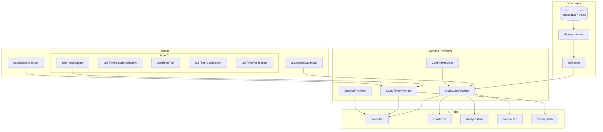
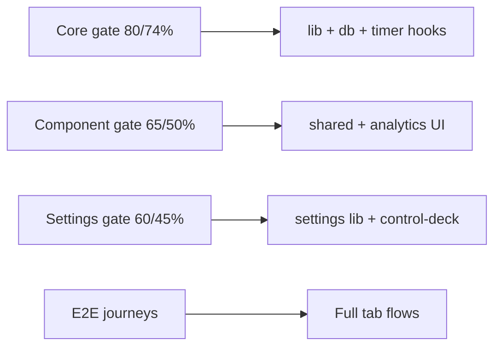

# Architecture

Local-first study dashboard: React 19 + Vite + Dexie (IndexedDB) + Tailwind v4.

## Context tree

## Testing pyramid

| Layer | Tool | Location |
|-------|------|----------|
| Unit | Vitest | `src/lib`, `src/db`, `src/hooks` |
| Component | Vitest + Testing Library | `src/components/**/__tests__` |
| Integration | Vitest + providers | `src/context/__tests__` |
| E2E | Playwright | `e2e/` |
| Visual / a11y | Storybook + addon-a11y | `src/**/*.stories.tsx` |

## Testing and coverage

Coverage is **gated by tier**, not universal across the entire UI. Full-app line coverage is intentionally not the goal — E2E and component tests cover integration paths; tier gates protect critical logic.

| Tier | Command | Thresholds | Scope |
|------|---------|------------|-------|
| Core | `npm run test:coverage` | 80% lines / 74% branches | `lib`, `db`, timer/backup hooks |
| Component | `npm run test:coverage:components` | 65% lines / 50% branches | Shared primitives and analytics UI |
| Settings | `npm run test:coverage:settings` | 60% lines / 45% branches | Control-deck panels and settings widgets |
| E2E | `npm run test:e2e` | Journey-based | Tab flows, settings, focus, backup |

## Data flow

- **Repositories** encapsulate Dexie CRUD (`src/db/repositories`).
- **Domain hooks** (`src/db/hooks`) expose live queries via `dexie-react-hooks`.
- **StudyDataProvider** aggregates settings, tasks, history, categories, flashcards, notes.
- **StudyTimerProvider** owns timer engine, backup import/export, and task actions.
- **StudyUIProvider** owns tab routing, zen mode, toasts, and theme CSS variables.

Import hooks from `db/hooks` — not legacy shims.

## PWA / offline

- Service worker precaches the app shell (`vite-plugin-pwa`).
- IndexedDB is the source of truth; no remote API.
- `AppShell` shows an offline banner when `navigator.onLine` is false.
