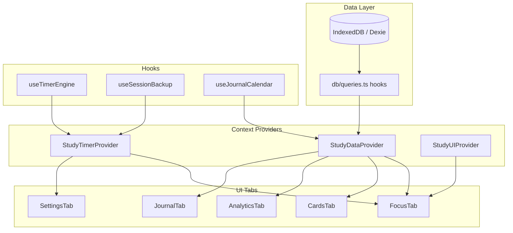

# Study Dashboard // The Cognitive Focus Console

A local-first, privacy-focused study dashboard with Pomodoro timing, task tracking, spaced repetition flashcards, analytics, and journaling.

**Created by Sankalpa KMCP**

---

## Core Premise: Local-First & Offline

- **Zero Cloud Dependency:** All data stays in IndexedDB on your device.
- **Absolute Privacy:** No telemetry, tracking, or remote APIs.
- **Self-Contained:** Runs entirely in the browser or as a Tauri desktop app.

---

## Features

### Focus Engine
- Configurable study block, short break, and long break durations
- Pomodoro cycle tracking with optional zen lockout during study
- Session reflection with attention/stability ratings
- Interrupted session recovery via `sessionStorage` heartbeat
- Screen wake lock during active study blocks

### Task Registry
- Priority-sorted tasks with cycle estimates
- SM-2 spaced repetition for study subjects
- Subtasks and auto-archive of completed tasks (90+ days)

### Recall Deck
- Flashcards with SM-2 scheduling
- Category filters and grade tracking

### Analytics Studio
- Weekly charts, category breakdown, retention curves
- Streak and XP leveling from study minutes

### Activity Ledger
- Calendar heatmap and daily mood/notes journal
- Per-day session history

### Control Deck
- Theme, opacity, blur, timer, sound, font, and backup settings
- Export/import `.studybackup` vault files and CSV reports

---

## Audio

The app plays **short session chimes** when blocks complete (toggle in Settings). Ambient soundscapes are not included in this build.

---

## Timer Settings

| Setting | Default | Description |
|---------|---------|-------------|
| `dailyGoalMinutes` | 480 | Daily study target |
| `studyBlockDurationMinutes` | 25 | Focus block length |
| `shortBreakDurationMinutes` | 5 | Short break length |
| `longBreakDurationMinutes` | 15 | Long break length |
| `targetSessionsPerCycle` | 4 | Study sessions before long break |

---

## Data Model

- **History entries** include `createdAt` (epoch ms) for reliable date filtering, plus a human-readable `timestamp` for display.
- **Emergency snapshots** are stored in IndexedDB (`snapshots` table), keeping the last 3 automatic backups.
- **Schema version:** 7 (Dexie `db.verno` — IndexedDB migration version).
- **Backup `version: 2`** in `.studybackup` JSON exports is the **export file format** revision — separate from the DB schema version above.

---

## Architecture



## Development

```bash
npm install
npm run dev            # Vite dev server at http://localhost:5173
npm run build          # Production build to dist/
npm test               # Vitest unit tests
npm run test:coverage  # Coverage report (70% threshold on scoped lib/db/hooks)
npm run test:watch     # Vitest watch mode
npm run test:e2e       # Playwright smoke tests
npm run storybook      # Component stories on port 6006
npm run build-storybook
npm run lint           # ESLint
```

### Testing guide

| Layer | Command | Location |
|-------|---------|----------|
| Unit / hooks | `npm test` | `src/lib/__tests__`, `src/db/__tests__`, `src/hooks/__tests__` |
| Context | `npm test` | `src/context/__tests__` |
| Coverage gate | `npm run test:coverage` | CI fails under 70% on scoped lib/db/hooks |
| E2E smoke | `npm run test:e2e` | `e2e/focus.spec.ts`, `e2e/settings.spec.ts` |
| Storybook | `npm run storybook` | `src/**/*.stories.tsx` |

### Tauri Desktop App

```bash
npm run tauri:dev    # Desktop dev with hot reload
npm run tauri:build  # Build native installer
```

---

## PWA Install

The app includes a web manifest and service worker (`vite-plugin-pwa`) for offline app-shell caching. Deploy to GitHub Pages or any static host; data remains in browser IndexedDB.

---

## Deployment (GitHub Pages)

Pushes to `master` or `V2` trigger automatic deployment via `.github/workflows/deploy-pages.yml`.

Base path: `/StudyApp/` (configured in `vite.config.ts`).

---

## License

Private project by Sankalpa KMCP.
