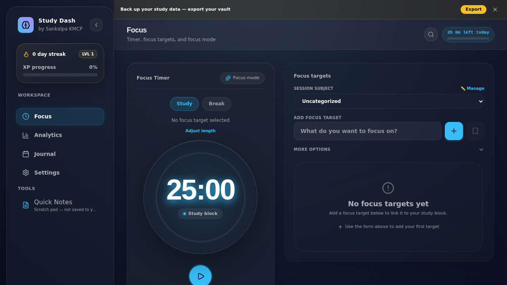
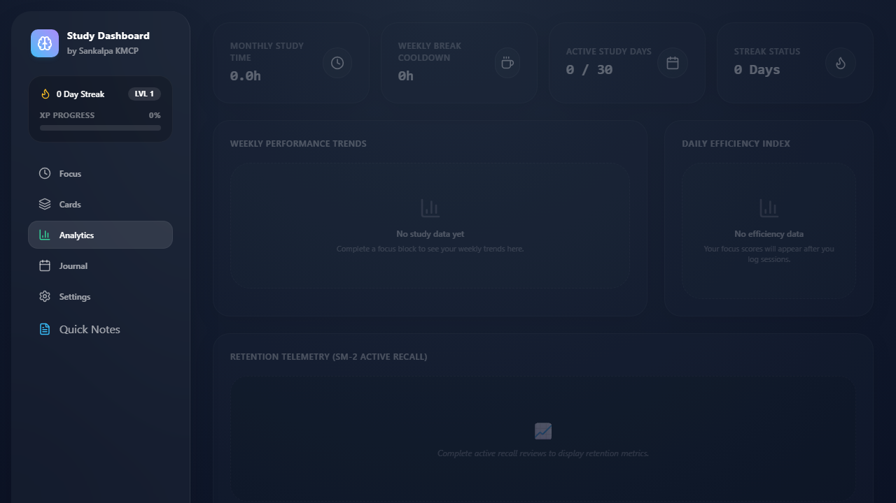
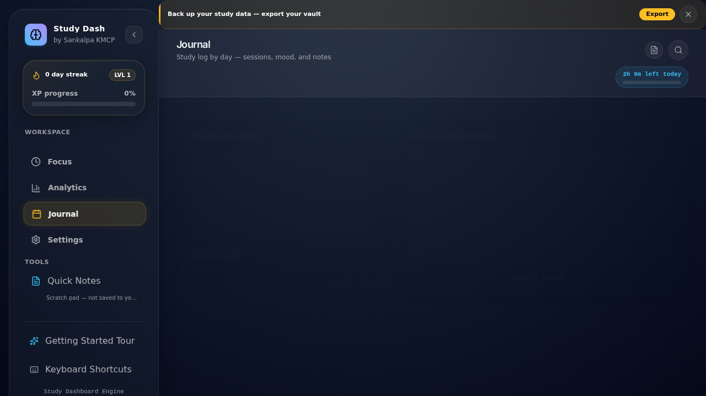
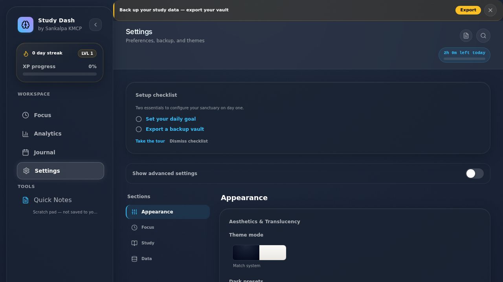

# Study Dashboard

**The Cognitive Focus Console** — a focus-first, local-first study dashboard with Pomodoro timing, task tracking, journal, analytics, and optional desktop sync.

Created by **Sankalpa KMCP**

[](CHANGELOG.md)
[](https://it25100142.github.io/StudyApp/)
[](https://nodejs.org/)

## Quick start

**Prerequisites:** Node.js 22 (matches CI). npm comes with Node.

```bash
npm ci
npm run dev
```

Open [http://localhost:5173](http://localhost:5173). On Windows, avoid trailing `#` comments on npm scripts — CMD passes them as extra args to Vite.

| Goal | Command |
|------|---------|
| Production build | `npm run build` |
| Unit tests | `npm test` |
| Desktop dev | `npm run tauri:dev` |
| E2E tests | `npm run test:e2e` |

If your editor workspace is the parent `study app` folder, run `npm run dev` from there — the root `package.json` delegates to this directory.

## Table of contents

- [Screenshots](#screenshots)
- [Why local-first](#why-local-first)
- [Features](#features)
- [Audio](#audio)
- [Timer defaults](#timer-defaults)
- [Data model](#data-model)
- [Architecture](#architecture)
- [Development](#development)
- [Desktop app (Tauri)](#desktop-app-tauri)
- [PWA install](#pwa-install)
- [Deployment](#deployment-github-pages)
- [License](#license)

## Screenshots

| Focus | Analytics | Journal | Settings |
|-------|-----------|---------|----------|
|  |  |  |  |

Regenerate with `npm run screenshots` (see [CONTRIBUTING.md](CONTRIBUTING.md)).

## Why local-first

- **Zero cloud dependency** — all data lives in IndexedDB on your device
- **Private by default** — no telemetry, tracking, or remote APIs
- **Runs anywhere** — browser PWA or Tauri desktop app, fully offline after first load

### Sync and portability

| Method | Best for |
|--------|----------|
| **Vault export/import** (`.studybackup`) | Manual backups, moving data between devices |
| **Folder sync** (Chrome/Edge + desktop) | Keeping the GitHub Pages site and Tauri app in sync on the same PC |

**Folder sync setup**

1. Install the desktop app from [GitHub Releases](https://github.com/IT25100142/StudyApp/releases).
2. In **Settings → Backup Vault → Folder sync**, choose a folder and enable sync in the desktop app.
3. On the [live site](https://it25100142.github.io/StudyApp/) (Chrome or Edge), open the same panel, pick the **same folder**, and enable sync.
4. Both clients share `study-vault.sync.studybackup` and stay in sync automatically.

Firefox and Safari can still use manual vault export/import. Folder sync requires the File System Access API.

### Known limits

- **Localization** — English UI with an i18n-ready catalog in `src/i18n/locales/en.json`
- **No cloud sync** — use vault files or folder sync for cross-device transfer
- **Ambient soundscapes** — procedural rain, white noise, café, and brown-noise presets (not sampled audio files)
- **Private license** — not open source (see [License](#license))

## Features

### Focus engine
- Configurable study, short break, and long break durations with Pomodoro cycle tracking
- Optional zen lockout during study blocks; screen wake lock while a block is active
- Session reflection with attention/stability ratings; interrupted-session recovery via `sessionStorage` heartbeat
- SM-2 / FSRS spaced repetition on focus targets; review-due banner on the Focus tab

### Task registry
- Priority-sorted tasks with cycle estimates, subtasks, and recurring tasks
- Task templates saved from the focus task form; virtual scrolling for large lists
- Auto-archive of completed tasks (configurable threshold, default 90+ days)

### Analytics studio
- Weekly charts, category breakdown, retention curves, and configurable productivity window (7 / 30 / 90 days or all time)
- Streak and XP leveling from study minutes; per-task and category goal trends

### Activity ledger
- Calendar heatmap, daily mood/notes journal, and per-day session history

### Control deck
- Theme, opacity, blur, timer, sound, font, and backup settings with live glass-card preview
- Export/import `.studybackup` vault files, CSV reports, and ICS calendar
- Command palette (`Ctrl`/`Cmd`+`K`), storage usage panel, optional history archival, Web Share backup on mobile

### UI
- Frosted glass panels built from shared `Card`, `Button`, and `ModalShell` primitives
- Per-theme page gradients; 11–12px minimum label typography

## Audio

**Session chimes** play when blocks complete (toggle in Settings). **Optional ambient loops** (rain, white noise, café, brown noise) play during active study blocks only — independent of chimes.

## Timer defaults

| Setting | Default | Description |
|---------|---------|-------------|
| `dailyGoalMinutes` | 120 | Daily study target |
| `studyBlockDurationMinutes` | 25 | Focus block length |
| `shortBreakDurationMinutes` | 5 | Short break length |
| `longBreakDurationMinutes` | 15 | Long break length |
| `targetSessionsPerCycle` | 4 | Study sessions before long break |
| `historyRetentionDays` | 0 | Auto-archive threshold (0 = keep all) |
| Backup reminder | 30 days | Reminds when no export; dismiss snoozes 7 days |

## Data model

- **History entries** include `createdAt` (epoch ms) for date filtering plus a human-readable `timestamp`
- **Emergency snapshots** in IndexedDB (`snapshots` table) — last 3 automatic backups retained
- **Schema version:** 12 (Dexie `db.verno`)
- **Backup format `version: 4`** in `.studybackup` JSON omits flashcards (legacy v2/v3 imports accepted; card rows discarded). v3 added `checksumSha256`. Separate from the DB schema version.

See [CHANGELOG.md](CHANGELOG.md) for release notes and migration history.

### Data limits

| Limit | Value | Used by |
|-------|-------|---------|
| Recent history window | 100 entries (50–500 configurable) | Timer settings (`recentHistoryLimit`) |
| Analytics window | 7d / 30d / 90d / all (default 30d) | `useAnalyticsHistoryRange` |
| Journal history | Current calendar month | `useHistoryForMonth` |
| Full history export | Unbounded | Backup export (`db.history.toArray`) |
| Auto snapshots | 3 retained | `useSessionBackup` |
| Shadow restore threshold | ≥ 60s elapsed | `useTimerEngine` sessionStorage heartbeat |
| Reflection notes max | 500 chars | Reflection modal |

## Architecture

**Stack:** React 19 · Vite 8 · TypeScript · Dexie (IndexedDB) · Tailwind v4 · Tauri 2 · Vitest · Playwright

Data hooks live in [`src/db/hooks/`](src/db/hooks/) (repositories + per-domain hooks). Architecture, layer rules, and AI agent docs: [`ai/PROJECT_CONTEXT.md`](ai/PROJECT_CONTEXT.md) (§6) and [`ai/ARCHITECTURE_DECISIONS.md`](ai/ARCHITECTURE_DECISIONS.md).

## Development

The git repository root is this `web/` folder.

```bash
npm ci
npm run dev          # http://localhost:5173
npm run build
npm test
npm run test:coverage
npm run test:coverage:components
npm run test:coverage:settings
npm run check:bundle
npm run test:watch
npm run test:e2e
npm run test:e2e:sync   # folder-sync specs only
npm run storybook
npm run build-storybook
npm run test:storybook
npm run lint
```

See [CONTRIBUTING.md](CONTRIBUTING.md) for migrations, settings conventions, and E2E patterns.

### Testing

| Layer | Command | Location |
|-------|---------|----------|
| Unit / hooks | `npm test` | `src/lib/__tests__`, `src/db/__tests__`, `src/hooks/__tests__` |
| Components | `npm test` | `src/components/**/__tests__` |
| Context / integration | `npm test` | `src/context/__tests__` |
| Coverage gate | `npm run test:coverage` | 80% lines / 74% branches |
| Component gate | `npm run test:coverage:components` | 65% lines / 50% branches |
| Settings gate | `npm run test:coverage:settings` | 60% lines / 45% branches |
| E2E | `npm run test:e2e` | `e2e/` |
| Storybook + a11y | `npm run storybook` | `@storybook/addon-a11y` on all stories |

## Desktop app (Tauri)

```bash
npm run tauri:dev     # Desktop dev with hot reload
npm run tauri:build   # Native installer
```

Push a version tag (`v*`, e.g. `v1.2.0`) to trigger the Tauri release workflow (`.github/workflows/tauri-release.yml`).

## PWA install

Web manifest and service worker (`vite-plugin-pwa`) cache the app shell for offline use. IndexedDB is the source of truth — no remote API. An offline banner appears when the network is unavailable.

## Deployment (GitHub Pages)

Pushes to `master` or `V2` deploy via `.github/workflows/deploy-pages.yml`.

- **Live URL:** [https://it25100142.github.io/StudyApp/](https://it25100142.github.io/StudyApp/)
- **Base path:** `/StudyApp/` (configured in `vite.config.ts`)

**One-time repo setup**

1. GitHub → Settings → Pages → Build and deployment → **Source: GitHub Actions**
2. Settings → Actions → General → Workflow permissions → **Read and write permissions**

Without GitHub Actions as the Pages source, `deploy-pages` fails with `401 Requires authentication`.

## License

Private project by Sankalpa KMCP.
