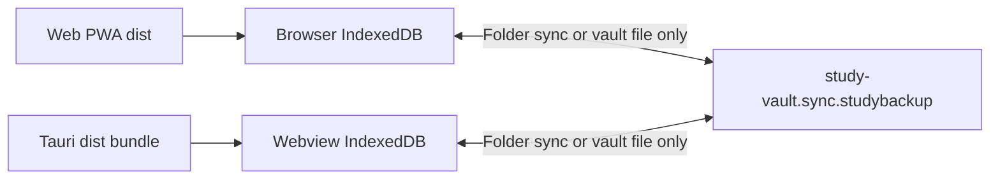
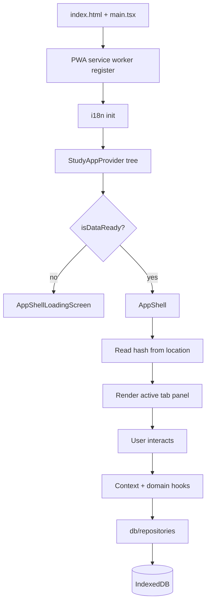
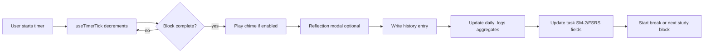
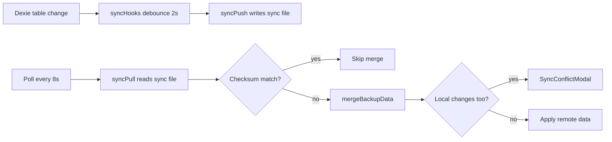
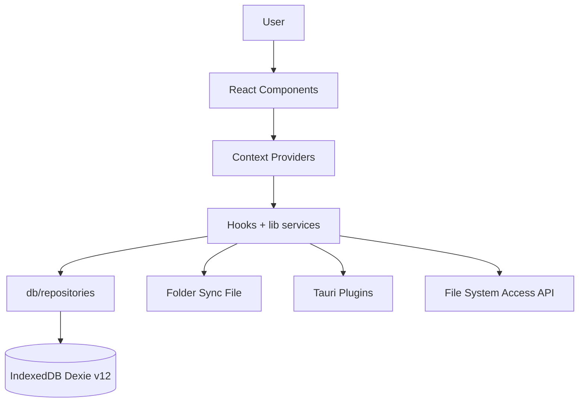

# Project Context

> **Study Dashboard v1.2.0** — local-first cognitive focus console.
> This document helps developers and AI coding agents understand the project quickly and safely.

## AI documentation index

| Doc | Purpose | Status |
|-----|---------|--------|
| [AI_RULES.md](AI_RULES.md) | Permanent agent operational rules | Present |
| [PROJECT_CONTEXT.md](PROJECT_CONTEXT.md) | This document — canonical codebase reference | Present |
| [CURRENT_STATE.md](CURRENT_STATE.md) | Active work snapshot | **Intentionally omitted** — use git history, `CHANGELOG.md`, and task context |
| [ARCHITECTURE_DECISIONS.md](ARCHITECTURE_DECISIONS.md) | ADR log (includes ADR-014: lib/sync + lib/backup repository access) | **Intentionally omitted** — ADR rationale inlined in this document §6 |
| [TASK_TEMPLATE.md](TASK_TEMPLATE.md) | Scoped task template | **Not present** |
| [PROMPT_PATTERNS.md](PROMPT_PATTERNS.md) | Reusable prompt patterns | **Not present** |

**Human-oriented docs:** [README.md](../README.md), [CONTRIBUTING.md](../CONTRIBUTING.md), [CHANGELOG.md](../CHANGELOG.md)

**Note:** Architecture guidance lives in this document (§6) and [AI_RULES.md](AI_RULES.md). Parent workspace [README.md](../../README.md) and [README.md](../README.md) §Architecture link here.

---

## 1. Project Overview

| Field | Value |
|-------|-------|
| **Project name** | Study Dashboard (`package.json` → `"name": "web"`, version `1.2.0`) |
| **Tagline** | "The Cognitive Focus Console" |
| **Author** | Sankalpa KMCP |
| **Type** | Local-first **frontend SPA** with optional **Tauri 2 desktop** wrapper |
| **Live demo** | [https://it25100142.github.io/StudyApp/](https://it25100142.github.io/StudyApp/) |

**Summary:** A focus-first study dashboard combining Pomodoro timing, task tracking, journaling, analytics, and data portability. All user data lives in the browser's IndexedDB — there is no backend server, cloud database, or user authentication.

**Problem it solves:** Students and knowledge workers need a private, offline-capable tool to track focused study sessions, manage tasks with spaced-repetition scheduling, review progress over time, and back up or sync data without relying on cloud services.

**Target audience:** Individual learners who value privacy, offline use, and local data ownership. Secondary audience: users who want the same data in both a browser PWA and a native desktop app via folder sync or vault files. Web and desktop share one frontend build but separate IndexedDB stores — see §4 Web vs desktop data boundary.

**Core purpose:** Provide a polished, distraction-minimizing focus environment with meaningful analytics and safe data export/import.

**Development status:** Actively maintained at v1.2.0 (June 2026). CI runs on pushes to `V2` and `master`. GitHub Pages deploys the web app; Tauri releases trigger on `v*` tags.

**Workspace layout:** The git repository root is `web/`. The parent `study app/` folder contains a delegating `package.json` that forwards `npm run dev`, `test`, `build`, `lint`, and `storybook` to `web/` — useful when the editor workspace is opened at the parent path.

**License:** Private — not open source (see [README.md](../README.md#license)).

---

## 2. Tech Stack

Technologies identified from the codebase with source locations.

### Core runtime and UI

| Technology | Version (approx.) | Identified from |
|------------|-------------------|-----------------|
| **React** | 19.x | `package.json`, `src/App.tsx`, `src/main.tsx` |
| **React DOM** | 19.x | `package.json`, `src/main.tsx` |
| **TypeScript** | ~6.0 | `package.json`, `tsconfig.json`, `tsconfig.app.json` |
| **Vite** | 8.x | `package.json`, `vite.config.ts` |
| **Tailwind CSS** | v4 | `package.json`, `vite.config.ts` (`@tailwindcss/vite`), `src/index.css` |
| **lucide-react** | 1.x | `package.json`, `src/navigation/appNav.ts` |
| **recharts** | 3.x | `package.json`, `src/components/analytics/` |
| **@tanstack/react-virtual** | 3.x | `package.json`, task/note list virtualization |
| **@fontsource/** (inter, outfit, jetbrains-mono) | 5.x | `package.json`, `src/lib/theme/loadAppFonts.ts` — on-demand font CSS |

### Data and storage

| Technology | Identified from |
|------------|-----------------|
| **Dexie** (IndexedDB ORM) | `package.json`, `src/db/db.ts` |
| **dexie-react-hooks** | `package.json`, `src/db/hooks/` |
| **IndexedDB** (browser API) | `src/db/db.ts`, section 6 below |
| **fake-indexeddb** (test mock) | `package.json`, `src/test/setup.ts` |

### Desktop

| Technology | Identified from |
|------------|-----------------|
| **Tauri 2** | `package.json`, `src-tauri/`, `src-tauri/tauri.conf.json` |
| **@tauri-apps/api** | `package.json`, `src/lib/desktop/tauri.ts` |
| **Tauri plugins** (autostart, dialog, fs, global-shortcut, notification) | `package.json`, `src/lib/desktop/tauri.ts`, `src-tauri/capabilities/default.json` |
| **Rust** (Tauri shell) | `src-tauri/Cargo.toml`, `src-tauri/src/lib.rs` |

### PWA and offline

| Technology | Identified from |
|------------|-----------------|
| **vite-plugin-pwa** | `package.json`, `vite.config.ts` |
| **Workbox** (via plugin) | `vite.config.ts` — precaches static assets, `navigateFallback: index.html` |

### Testing and quality

| Technology | Identified from |
|------------|-----------------|
| **Vitest** | `package.json`, `vitest.config.ts`, `vitest.components.config.ts`, `vitest.settings.config.ts` |
| **@testing-library/react** | `package.json`, `src/components/**/__tests__/` |
| **Playwright** | `package.json`, `playwright.config.ts`, `e2e/` |
| **Storybook** | `package.json`, `.storybook/`, `*.stories.tsx` |
| **ESLint** | `package.json`, `eslint.config.js` |
| **Lighthouse CI** | `.lighthouserc.json`, `.github/workflows/ci.yml` |

### Build, package manager, deployment

| Item | Identified from |
|------|-----------------|
| **npm** (package manager) | `package-lock.json`, `README.md`, CI workflows |
| **Node.js 22** | `README.md`, `.github/workflows/ci.yml` |
| **GitHub Actions** (CI/CD) | `.github/workflows/ci.yml` (check, chromatic, storybook, e2e, e2e-sync, e2e-firefox, e2e-webkit), `deploy-pages.yml`, `tauri-release.yml`, `screenshots.yml` |
| **GitHub Pages** | `vite.config.ts` (`base: '/StudyApp/'`), `deploy-pages.yml` |

### Not present

- No backend framework (Express, Fastify, etc.)
- No SQL/NoSQL server database (PostgreSQL, MongoDB, etc.)
- No GraphQL, REST API server, or WebSocket server
- No authentication library (OAuth, JWT, session auth)
- No React Router — navigation uses hash routing (`src/lib/routing/appHashRouting.ts`)
- No Redux, Zustand, or similar global state library — React Context + hooks

---

## 3. Project Structure

```
web/                              # Git repository root
├── index.html                    # HTML entry — mounts #root, GitHub Pages redirect script
├── package.json                  # Dependencies and npm scripts
├── package-lock.json             # npm lockfile
├── vite.config.ts                # Vite build, PWA, code splitting, base path
├── tsconfig.json                 # TypeScript project references
├── tsconfig.app.json             # App TypeScript config
├── tsconfig.node.json            # Node/build tooling TypeScript config
├── eslint.config.js              # ESLint + jsx-a11y + import guard rules
├── vitest.config.ts              # Core unit test + coverage gate config
├── vitest.components.config.ts   # Component coverage tier
├── vitest.settings.config.ts     # Settings/control-deck coverage tier
├── playwright.config.ts          # E2E test config
├── playwright.screenshots.config.ts
├── .lighthouserc.json            # Lighthouse CI thresholds
├── .env.example                  # Documented optional env vars (copy to .env.local when needed)
├── .npmrc                        # npm config (`engine-strict=false`)
├── .cursor/rules/                # Cursor agent rules (e.g. ai-documentation-sync.mdc)
├── .storybook/                   # Storybook configuration
├── .github/workflows/            # CI, deploy, Tauri release, screenshots
├── .githooks/                    # pre-push hook (commit author email check)
├── scripts/                      # Bundle size check, PWA icon generation
├── public/                       # Static assets (manifest, icons, 404.html)
├── docs/screenshots/             # README tab screenshots
├── e2e/                          # Playwright E2E specs (26 files)
├── src/
│   ├── main.tsx                  # Bootstrap: PWA SW, i18n, E2E sync adapter, render App
│   ├── App.tsx                   # Provider tree → AppShell
│   ├── index.css                 # Global styles + Tailwind
│   ├── vite-env.d.ts             # Vite env type declarations
│   ├── components/               # UI components
│   │   ├── ActivityLedger.tsx    # Journal tab main component (lazy-loaded by JournalTab)
│   │   ├── tabs/                 # Tab wrappers + FocusTabContent (FocusTab lazy-loads FocusTabContent)
│   │   ├── control-deck/         # Settings panels (timer, backup, sync, etc.)
│   │   │   ├── backup-vault/     # BackupVaultPanel + export/import/ICS/reset sections
│   │   │   ├── StorageUsagePanel.tsx
│   │   │   ├── SettingsOnboardingBanners.tsx
│   │   │   └── BackupVaultPanel.tsx  # Re-export barrel → backup-vault/
│   │   ├── sidebar/              # Desktop sidebar navigation (+ SidebarFlyoutProvider)
│   │   ├── focus/                # Timer display, controls; FocusTaskSection.tsx exports FocusStudyTipSection + FocusActiveTaskLabel
│   │   ├── analytics/            # Charts, heatmap, retention panels
│   │   ├── activity-ledger/      # Journal sub-panels (MoodPicker, DayDetailPanel) — main ledger is ActivityLedger.tsx at components root
│   │   ├── task-registry/        # Task list, create form, filters
│   │   ├── quick-notes/          # Notes drawer components
│   │   ├── app-shell/            # Loading screen, banners, AppToastOverlay, layout
│   │   └── shared/               # Button, Card, ModalShell, PanelCard, MetricCard, TabPageShell, VirtualList, CelebrationConfettiHost, settings/*
│   ├── context/                  # React context providers + facade hooks
│   │   ├── StudyAppProvider.tsx, StudyDataProvider.tsx, StudyTimerProvider.tsx, StudyUIProvider.tsx
│   │   ├── ConfirmProvider.tsx   # Destructive-action confirm dialog context
│   │   ├── studyTimerContext.ts  # StudyTimerContext + StudyTimerDisplayContext
│   │   ├── sidebar/              # SidebarCollapseProvider
│   │   ├── useStudyApp.ts        # Public facade hooks (useStudyData, useStudyUI, …)
│   │   ├── studyDataSlices.ts    # StudyCore / Gamification / Extended slice contexts
│   │   ├── useStudyDataState.ts, useStudyUIState.ts, useStudyUIProviderValue.ts
│   │   └── settingsPanelContext.tsx
│   ├── db/
│   │   ├── db.ts                 # Dexie schema + migrations (v12)
│   │   ├── types.ts              # TypeScript interfaces for all tables
│   │   ├── hooks.ts              # Barrel re-exporting live-query hooks
│   │   ├── repositories/         # CRUD and bulk operations
│   │   ├── hooks/                # Live query hooks (dexie-react-hooks)
│   │   └── selectors/            # Row parsing (`settingsFromRows.ts`), task sorting
│   ├── hooks/                    # App logic hooks (~81 files)
│   │   ├── timer/                # Timer engine sub-hooks
│   │   ├── backup/               # Vault export/import hooks (+ types, helpers)
│   │   ├── routing/              # Hash ↔ tab sync (`useActiveTabSync`)
│   │   ├── theme/                # Theme CSS variable effects
│   │   ├── analytics/            # Chart data hooks
│   │   ├── activity-ledger/      # Ledger intensity styles (`useLedgerCalendar`)
│   │   ├── quick-notes/          # Note editor/filter hooks
│   │   ├── app-shell/            # AppShell effect hooks
│   │   └── sidebar/              # Sidebar flyout/collapse (`useSidebarCollapse`)
│   ├── lib/                      # Domain services (pure logic)
│   │   ├── backup/               # Export, import, crypto, checksum, merge, share, metadata
│   │   ├── sync/                 # Folder sync orchestrator, push/pull
│   │   ├── study/                # Pomodoro math, SM-2/FSRS, lockout, setup checklist, first session
│   │   ├── settings/             # Validation, defaults, sections, advanced mode
│   │   ├── theme/                # Theme profiles, CSS variables
│   │   ├── export/               # ICS import/export, weekly report export
│   │   ├── desktop/              # Tauri bridge, wake lock, notifications
│   │   ├── audio/                # Ambient sound engine
│   │   ├── routing/              # Hash routing, activeTab store, command palette search, prefetch
│   │   └── shared/               # Constants, dev logger, copyDebugInfo, UX terms
│   ├── navigation/               # Tab definitions (appNav.ts), shared NavTabButton.tsx
│   ├── i18n/                     # i18n: index.ts, locales/en.json, useTranslation.ts
│   ├── types/                    # App-level types (ActiveTab, etc.)
│   ├── styles/                   # tokens.css, animations.css, nav-accents.css, surfaces.css, controls.css, mood-picker.css (imported by index.css)
│   └── test/                     # Vitest setup and test utilities
├── src-tauri/                    # Tauri 2 desktop shell
│   ├── src/main.rs, lib.rs       # Tray, plugins, window lifecycle
│   ├── tauri.conf.json           # App metadata, build config
│   └── capabilities/default.json # FS scope permissions
├── README.md
├── ai/                     # AI documentation system (this folder)
├── CONTRIBUTING.md
└── CHANGELOG.md
```

### How major parts connect

```
index.html
  └── src/main.tsx          (PWA SW, i18n, optional E2E sync adapter)
        └── src/App.tsx     (SidebarCollapseProvider → StudyAppProvider → ErrorBoundary → AppShell)
              └── StudyAppProvider
                    └── ConfirmProvider → StudyDataProvider → StudyTimerProvider → StudyUIProvider
                          └── ErrorBoundary   (inside StudyUIProvider — provider errors are not caught)
                                └── AppShell    (layout, tabs, modals, command palette)
                                      ├── FocusTab / AnalyticsTab / JournalTab / SettingsTab
                                      ├── context hooks (useStudyData, useStudyUI, useStudyTimerContext)
                                      ├── domain hooks (useTimerEngine, useSessionBackup, etc.)
                                      ├── db/hooks.ts barrel → db/hooks/* (useTasks, useSettings, …)
                                      ├── db/repositories (tasks.ts, settings.ts, …)
                                      └── db/db.ts → IndexedDB (StudyDashboardDB)
```

---

## 4. Core Features

### Focus Engine

**Purpose:** Run Pomodoro-style study/break cycles with optional distraction lockout, session reflection, and spaced-repetition scheduling on focus targets.

**How it works:**
1. User selects a task and starts a study block.
2. `useTimerEngine` ticks down via `useTimerTick`; completion triggers chimes and optional reflection modal.
3. Session is written to `history` table; daily aggregates update `daily_logs`.
4. SM-2 or FSRS algorithm updates task review dates (`nextReviewDate`, `easinessFactor`, etc.).
5. Zen lockout (`enforce_lockout`) blocks navigation away from Focus tab during active study.
6. Interrupted sessions can be recovered via `sessionStorage` heartbeat (`useTimerSessionShadow`).
7. Screen wake lock during active study blocks via `hooks/timer/useWakeLock.ts` → `lib/desktop/wakeLock.ts`.
8. Review-due tasks surface `ReviewDueBanner` on Focus tab (`useReviewDueCount`, `lib/study/taskFilters.ts`); `ReviewQueueSection` in task list.

**Important files:**
- `src/components/tabs/FocusTab.tsx`, `src/components/focus/` (incl. `FirstSessionBanner.tsx`, `ReviewDueBanner.tsx`)
- `src/hooks/useTimerEngine.ts`, `src/hooks/timer/` (incl. `useWakeLock.ts`)
- `src/hooks/useReviewDueCount.ts`
- `src/lib/study/focusLockout.ts`, `src/lib/study/resolveTimerDurations.ts`, `src/lib/study/firstSession.ts`
- `src/db/repositories/history.ts`, `src/db/repositories/tasks.ts`

**Related data:** `tasks`, `history`, `daily_logs`, `settings` (timer keys)

---

### Task Registry

**Purpose:** Manage study tasks with priorities, cycle estimates, subtasks, recurrence, and per-task timer overrides.

**How it works:**
1. Tasks stored in IndexedDB `tasks` table via `db/repositories/tasks.ts`.
2. `TaskRegistry` component renders virtualized list when count > 100.
3. Creating/editing tasks updates Dexie; completed tasks can auto-archive after configurable days.
4. Recurring tasks spawn new instances via `hooks/useTaskRecurrence.ts` (`getNextRecurrenceDate` in `lib/study/recurrence.ts`).
5. Saved task templates (localStorage `task_templates`) speed up repeat task creation via `lib/study/taskTemplates.ts` / `TaskCreateForm.tsx`.

**Important files:**
- `src/components/TaskRegistry.tsx`
- `src/components/task-registry/TaskCreateForm.tsx`
- `src/lib/study/taskTemplates.ts`
- `src/db/repositories/tasks.ts`
- `src/db/selectors/sortTasks.ts`
- `src/hooks/useTaskActions.ts`

**Related data:** `tasks`, `categories`

---

### Analytics Studio

**Purpose:** Visualize study patterns, streaks, XP leveling, category breakdown, and retention curves.

**How it works:**
1. `AnalyticsTab` lazy-loads when tab is active (`useLazyStudyFeatures`).
2. `useAnalyticsHistoryRange` filters history by productivity window (7/30/90 days or all).
3. Recharts renders weekly trends, category goals, retention charts.
4. XP and streaks computed from `daily_logs` and `history` in `lib/study/studyDashboard/`.
5. Weekly report export (CSV/Markdown) via `lib/export/weeklyReportExport.ts` in `AnalyticsTab`.
6. Level-up celebration UI: `LevelUpModal` + `CelebrationConfettiHost` when XP thresholds crossed (`useGamification`, `pendingLevelUp` in `useStudyData`).

**Important files:**
- `src/components/tabs/AnalyticsTab.tsx`
- `src/components/analytics/`
- `src/components/LevelUpModal.tsx`, `src/components/shared/CelebrationConfettiHost.tsx`
- `src/hooks/useAnalyticsHistoryRange.ts`
- `src/lib/study/studyDashboard/`
- `src/lib/export/weeklyReportExport.ts`

**Related data:** `history`, `daily_logs`, `tasks`, `categories`

---

### Activity Ledger (Journal)

**Purpose:** Calendar heatmap, daily mood/notes, and per-day session history.

**How it works:**
1. `JournalTab` shows calendar via `useJournalCalendar`.
2. Selecting a day displays session entries from `history` and mood/notes from `daily_logs`.
3. History filtered to current calendar month by `useHistoryForMonth`.

**Important files:**
- `src/components/tabs/JournalTab.tsx` (lazy-loads `ActivityLedger.tsx`)
- `src/components/ActivityLedger.tsx`
- `src/components/activity-ledger/` (`MoodPicker`, `DayDetailPanel`)
- `src/hooks/useJournalCalendar.ts`
- `src/db/hooks/useAllDailyLogs.ts`, `src/db/hooks/useTodayLog.ts`

**Related data:** `daily_logs`, `history`

---

### Control Deck (Settings)

**Purpose:** Configure appearance, timer, sound, algorithms, categories, backup, sync, and desktop options.

**How it works:**
1. `SettingsTab` wraps `ControlDeck` with section navigation.
2. Four sections: appearance, focus, study, data (`src/lib/settings/settingsSections.ts`).
3. Settings panels lazy-load; advanced panels hidden until advanced mode enabled (`settingsAdvancedMode.ts`, `useSettingsAdvancedMode.ts`, localStorage key `settings_show_advanced`).
4. `SettingsOnboardingBanners` shows setup checklist (daily goal, backup export) via `lib/study/setupChecklist.ts`.
5. All writes go through `useSettingsUpdater` → `validateSetting()` → `db/repositories/settings.ts`.
6. Study reminders (`studyReminderEnabled`, `studyReminderTime`, `studyReminderOnlyBelowGoal`) schedule notifications via `useStudyReminder` in `useAppShellEffects`.

**Important files:**
- `src/components/tabs/SettingsTab.tsx`
- `src/components/ControlDeck.tsx`
- `src/components/control-deck/*Panel.tsx`
- `src/lib/settings/settingsValidation.ts`
- `src/lib/settings/settingsSections.ts`

**Related data:** `settings`, `categories`

---

### Backup Vault

**Purpose:** Export/import `.studybackup` vault files for manual backup and data migration.

**How it works:**
1. Export serializes all tables via `db/repositories/database.ts` → `exportAllTables`.
2. Optional AES-GCM encryption (PBKDF2, 100k iterations) via `lib/backup/backupCrypto.ts`.
3. SHA-256 checksum embedded in backup envelope (format version 4).
4. Import validates schema, verifies checksum, optionally shows merge preview (`lib/backup/mergePreview.ts`).
5. Web Share API export on supported mobile browsers (`lib/backup/backupShare.ts`).
6. `StorageUsagePanel` shows IndexedDB quota estimate and per-table row counts (`useStorageEstimate`, `storageStats` repository).
7. Emergency snapshots (last 3) stored in `snapshots` table before risky operations.
8. Backup reminder timing tracked in localStorage via `lib/backup/backupMetadata.ts` (`last_backup_export_at`, `last_backup_dismissed`); `AppShell` runs `useBackupReminder()` and passes `showBackupReminder={backupReminder.shouldRemind}` to `AppShellLayout`, which forwards to `Sidebar` and `MobileTabBar`. When true, the Settings tab shows an amber notification dot and appends `bannerBackupReminderAria` to the nav button aria-label via `NavTabButton` — no global banner region is rendered.
9. CSV/ICS reports section (`backup-vault/CsvIcsReportsSection.tsx`) exports study logs CSV, history ICS, task-completion CSV; imports history from ICS (`lib/export/icsImport.ts`, `hooks/backup/useBackupIcs.ts`); can archive history older than `historyRetentionDays`.

**Important files:**
- `src/components/control-deck/BackupVaultPanel.tsx` (re-export) → `src/components/control-deck/backup-vault/BackupVaultPanel.tsx`
- `src/components/control-deck/backup-vault/CsvIcsReportsSection.tsx`
- `src/components/control-deck/StorageUsagePanel.tsx`, `SettingsOnboardingBanners.tsx`
- `src/navigation/NavTabButton.tsx`, `src/components/sidebar/SidebarNavButton.tsx`, `src/components/MobileTabBar.tsx`, `src/components/app-shell/AppShellLayout.tsx`
- `src/hooks/backup/useBackupVaultExport.ts`, `useBackupVaultImport.ts`, `useBackupVaultPanelState.ts`, `useBackupIcs.ts`
- `src/hooks/useSessionBackup.ts`, `useStorageEstimate.ts`, `useBackupReminder.ts`
- `src/lib/backup/backupExport.ts`, `backupMerge.ts`, `backupCrypto.ts`, `backupChecksum.ts`, `backupShare.ts`, `mergePreview.ts`, `backupMetadata.ts`, `csvExport.ts`
- `src/lib/export/icsImport.ts`, `icsExport.ts`
- `src/lib/study/studyDashboard/backupSchema.ts`

**Related data:** All tables; backup format version 4 (no flashcards)

---

### Folder Sync

**Purpose:** Bidirectional sync between web (Chrome/Edge) and Tauri desktop via a shared folder file.

**How it works:**
1. User picks a sync folder (File System Access API on web, Tauri dialog on desktop).
2. App reads/writes `study-vault.sync.studybackup` in that folder.
3. Dexie table changes trigger debounced push (2s) via `syncHooks.ts` → `syncPush.ts`.
4. Poll every 8s pulls remote changes via `syncPull.ts` → `mergeBackupData`.
5. Conflicts surface `SyncConflictModal` instead of silent overwrite.

**Important files:**
- `src/components/control-deck/FolderSyncPanel.tsx`
- `src/hooks/useFolderSync.ts` (starts orchestrator from `AppShell` via `useAppShellEffects`)
- `src/lib/sync/syncOrchestrator.ts`, `syncPush.ts`, `syncPull.ts`
- `src/lib/sync/fileSystemAccess.ts`, `desktopSyncAdapter.ts`
- `src/db/repositories/syncHooks.ts`, `syncHandles.ts`

**Related data:** `sync_handles`, settings (`syncEnabled`, `syncFolderPath`, `lastSyncAt`, `lastSyncChecksum`)

**External dependency:** File System Access API (Chrome/Edge) or Tauri FS plugin

---

### Quick Notes

**Purpose:** Lightweight note-taking drawer accessible from any tab.

**How it works:**
1. `QuickNotesDrawer` lazy-loads from `AppShell`.
2. Notes CRUD via `db/repositories/quickNotes.ts` and `db/hooks/useQuickNotes`.
3. Virtualized list when count > 50.
4. Deletes use delayed commit with undo toast (`useUndoDelete`, `hooks/app-shell/useNoteDeleteUndo.ts` → `restoreNote` in repository).

**Important files:**
- `src/components/QuickNotesDrawer.tsx`
- `src/components/quick-notes/`
- `src/db/repositories/quickNotes.ts`
- `src/hooks/useUndoDelete.ts`, `src/hooks/app-shell/useNoteDeleteUndo.ts`

**Related data:** `quick_notes`

---

### Command Palette

**Purpose:** Keyboard-driven actions (`Ctrl`/`Cmd`+`K`) for navigation, timer control, backup, and search.

**How it works:**
1. `CommandPalette` lazy-loads; opened via keyboard shortcut or header button.
2. `lib/routing/commandPaletteSearch.ts` indexes tasks, notes, and actions.
3. Selection triggers navigation, timer toggle, export, etc. via `useCommandPaletteActions`.

**Important files:**
- `src/components/CommandPalette.tsx`
- `src/hooks/app-shell/useCommandPaletteActions.ts`
- `src/lib/routing/commandPaletteSearch.ts`

---

### Audio (chimes and ambient)

**Purpose:** Block-completion chimes and optional procedural ambient loops during active study blocks.

**How it works:**
1. `useAmbientSynth` (`hooks/useAmbientSynth.ts`) plays completion chimes when `soundEnabled`; optional tactile feedback via Web Audio API.
2. `useAmbientSound` drives procedural presets (`rain`, `white-noise`, `cafe`, `brown-noise`) from `lib/audio/ambientAudio.ts` — plays only during active **study** blocks when `ambientSoundEnabled`.
3. Both wired in `context/useStudyTimerState.ts` (hosted by `StudyTimerProvider`).

**Settings:** `soundEnabled`, `ambientSoundEnabled`, `ambientSoundPreset`, `ambientVolume`, `tactile_feedback`

**Important files:**
- `src/hooks/useAmbientSynth.ts`, `src/hooks/useAmbientSound.ts`
- `src/lib/audio/ambientAudio.ts`
- `src/context/useStudyTimerState.ts`

---

### PWA and Desktop

**Purpose:** Offline app shell, install prompt, and native desktop experience.

**How it works (PWA):**
- `vite-plugin-pwa` registers service worker in `main.tsx`.
- Static assets precached; IndexedDB is source of truth.
- `AppShellStatusBanners` shows offline banner when `navigator.onLine` is false.
- Install prompt via `usePwaInstall` → `InstallPromptBanner` (dismiss snooze: localStorage `pwa_install_dismissed_until`).

**How it works (Desktop):**
- Tauri wraps the same Vite `dist/` build (`src-tauri/tauri.conf.json` → `frontendDist: ../dist`, `beforeBuildCommand: npm run build`); tray menu (Show / Toggle timer / Quit).
- Plugins: autostart, global shortcut, native notifications, folder picker, FS writes.
- Minimize-on-close option; wake lock during active study blocks.
- Production base path is `/` (Tauri); web GitHub Pages build uses `/StudyApp/` (`vite.config.ts` when `TAURI_ENV_PLATFORM` is set).

**Web vs desktop data boundary:** Same React codebase and build output, two isolated local data stores. There is no backend linking web and desktop automatically.

- **Web (PWA):** Served from GitHub Pages; IndexedDB lives in the browser profile for that origin (`StudyDashboardDB`).
- **Desktop (Tauri):** Bundled `dist/` runs in a Tauri webview with its **own** IndexedDB — data from the browser install does not appear in the desktop app unless transferred.
- **Linking instances:** Manual `.studybackup` export/import, or **folder sync** (shared `study-vault.sync.studybackup` on the same machine via File System Access API + Tauri FS). Not cloud sync or automatic cross-device pairing.



**Important files:**
- `src/main.tsx`, `vite.config.ts`
- `src/lib/desktop/tauri.ts`, `wakeLock.ts`, `focusNotifications.ts`
- `src/components/app-shell/DesktopTrayTimerBridge.tsx`
- `src/components/InstallPromptBanner.tsx`, `src/hooks/usePwaInstall.ts`
- `src-tauri/src/lib.rs`, `src-tauri/capabilities/default.json`

---

## 5. Application Flow

### Main user journey



### Provider nesting order

```
SidebarCollapseProvider          (src/context/sidebar/SidebarCollapseProvider.tsx — src/App.tsx)
  └── StudyAppProvider           (src/context/StudyAppProvider.tsx)
        └── ConfirmProvider
              └── StudyDataProvider      (tasks, history, settings, categories, notes, analytics)
                    └── StudyTimerProvider   (timer engine, backup, task actions; StudyTimerDisplayContext nested inside)
                          └── StudyUIProvider    (tab routing, zen mode, toasts, theme vars)
                                └── ErrorBoundary    (src/App.tsx — errors in providers above are NOT caught)
                                      └── AppShell
```

**Scoped providers (not app-wide):**
- `SettingsPanelProvider` — wraps `ControlDeck` only (`src/components/ControlDeck.tsx`)
- `SidebarFlyoutProvider` — mounts when sidebar is collapsed (`src/components/sidebar/SidebarShell.tsx`)

`StudyAppProvider` nests Confirm → Data → Timer → UI in `src/context/StudyAppProvider.tsx`. `SidebarCollapseProvider` and `ErrorBoundary` are wired in `src/App.tsx`.

### Deferred data loading

Quick notes and full daily-log queries are **not** loaded on initial app mount. `useStudyUIState` calls `setDeferredDataFlags()` when the notes drawer or command palette opens; `StudyDataProvider` reads flags via `useDeferredDataFlags()` (`src/hooks/useDeferredDataEnabled.ts`). Analytics/journal tab data still lazy-loads via `useLazyStudyFeatures(activeTab)`.

### Hash routing flow

1. On load, `useStudyUIState` initializes `activeTab` from `readAppHashFromLocation()` (`src/lib/routing/appHashRouting.ts`).
2. Valid tabs: `focus` (default), `analytics`, `journal`, `settings`.
3. Settings deep links: `#settings/appearance`, `#settings/focus`, `#settings/study`, `#settings/data`.
4. Legacy `#cards` redirects to `#focus` (v12 migration).
5. `hooks/routing/useActiveTabSync.ts` (wired in `useStudyUIProviderValue`, aliased as `useActiveTabHashSync`) keeps hash and UI tab in sync: writes `writeAppHash()` on tab change; listens for `hashchange` and calls `navigateToTab` when the hash changes externally.
6. `lib/routing/activeTabSync.ts` exposes a module-level `useActiveTabStore()` hook so `StudyDataProvider` can read the active tab for lazy data loading **without** importing UI context.

**Naming note:** Hash sync side effects live in `hooks/routing/useActiveTabSync.ts`; the data-layer tab subscription is `useActiveTabStore()` in `lib/routing/activeTabSync.ts`.

### Journal deep-link queue

Command palette and other flows can queue a journal date before navigating to the Journal tab. `src/lib/routing/journalNavigation.ts` stores the date in `sessionStorage` under key `pending_journal_date` (`PENDING_JOURNAL_DATE_KEY`); the journal tab consumes it on mount.

### Timer session flow



### Backup export flow

1. User triggers export from Backup Vault or command palette.
2. `useBackupVaultExport` calls `exportAllTables()` from `db/repositories/database.ts`.
3. Payload validated, checksum computed, optionally encrypted.
4. Browser download or Tauri FS write (desktop auto-export).

### Backup import flow

1. User selects `.studybackup` file.
2. `validateBackupPayload()` checks structure (`backupSchema.ts`).
3. Checksum verified (`backupChecksum.ts`).
4. Optional merge preview shown for non-destructive import.
5. `replaceAllTables()` or `mergeBackupData()` writes to IndexedDB.

### Folder sync flow



Orchestrated by `src/lib/sync/syncOrchestrator.ts`.

### Onboarding flow

1. First visit checks `localStorage` key `sanctuary_onboarding_completed`.
2. `OnboardingModal` shown via `useAppShellOnboarding`.
3. User completes or dismisses; key set to prevent re-show.
4. After first timer completion, `lib/study/firstSession.ts` may set `focus_first_run_pending` → `FirstSessionBanner` on Focus tab.
5. Settings tab shows setup checklist (`SettingsOnboardingBanners`) until daily goal and backup milestones are met or dismissed.

### Background schedulers (AppShell)

When `isDataReady`, `useAppShellEffects` wires non-UI background services:

| Hook | Purpose |
|------|---------|
| `useStudyReminder` | Daily study reminder notification at configured time (`studyReminderEnabled`, `studyReminderTime`) |
| `useAutoExport` | Scheduled vault auto-export (`autoExportEnabled`, `autoExportIntervalDays`) |
| `useFolderSync` | Starts/stops `syncOrchestrator` when folder sync enabled |
| Desktop init | Applies saved autostart/shortcut settings on Tauri startup (`lib/desktop/tauri.ts`) |

Separately, `AppShell` runs `useBackupReminder()` and passes `showBackupReminder` to `AppShellLayout` → Settings nav notification dot (`NavTabButton.showNotificationDot`). Status banners (offline, PWA install, quota recovery) are passed as a `banners` prop to `AppShellLayout` and rendered via `AppShellStatusBanners` (offline + PWA prominent; quota recovery collapsible). Toasts render at AppShell root via `AppShellToast` → `AppToastOverlay`, outside the layout.

### Error handling flow

1. React errors caught by `ErrorBoundary` → `ErrorFallback` with emergency export and DB reset options.
2. Dexie quota/DB errors caught globally in `db.ts` → `dexie-error` custom event → `QuotaRecoveryBanner`.
3. Backup/sync failures log via `console.error` and show toast notifications.

---

## 6. Architecture Explanation

### High-level architecture

This is a **local-first single-page application**. All business logic runs in the browser (or Tauri webview). IndexedDB via Dexie is the sole persistent data store. There is no server-side component.



### Frontend architecture

The app follows a **strict unidirectional data pipeline**. UI never reaches the database directly; all persistence flows through context facades, hooks, pure lib functions, and repositories.

```
UI (components/)
  → Context facades (useStudyApp.ts, providers)
  → Hooks (hooks/)
  → Domain lib (lib/)
  → Repositories (db/repositories/)
  → Dexie (db/db → IndexedDB)
```

| Layer | Location | Responsibility |
|-------|----------|----------------|
| **UI** | `src/components/` | Presentational and container components — **read state via context facade hooks or props only** |
| **Context** | `src/context/` | Provider composition, slice contexts, and public facade hooks (`useStudyData`, `useStudyUI`, …) |
| **Hooks** | `src/hooks/` | Composed business logic, side effects, repository orchestration |
| **Domain services** | `src/lib/` | Pure functions, algorithms, I/O adapters (no React) |
| **Data access** | `src/db/repositories/` | Dexie CRUD encapsulation |
| **Live queries** | `src/db/hooks/` | Reactive IndexedDB subscriptions (used by providers/hooks, not components) |

### Layer import rules (ESLint + architectural convention)

**ESLint enforcement** (`eslint.config.js`): `no-restricted-imports` blocks `db/db` imports from `src/components/`, `src/hooks/`, and `src/lib/`. Tests are exempt. ESLint does **not** block `db/repositories` or `db/hooks` in components — that restriction is an **architectural convention** enforced by code review and facade-hook discipline (verified: no components currently import repositories).

**Golden rule:** Components must **never** import from `db/repositories/`, `db/hooks/`, or `db/db`. All data access in UI goes through context facade hooks in `src/context/useStudyApp.ts` (or narrower timer/UI contexts), or through props passed from a parent that already consumed those hooks.

| Layer | May import | Must NOT import |
|-------|------------|-----------------|
| `components/` | `context/` facades, `hooks/` (UI-only helpers), `lib/` (display helpers), `db/types` | `db/repositories/`, `db/hooks/`, `db/db` |
| `context/` | `hooks/`, `lib/`, `db/types`, slice contexts — **no direct DB access** | `db/repositories/`, `db/hooks/`, `db/db` |
| `hooks/` | `db/repositories/`, `db/hooks/`, `db/types`, `lib/` | `db/db` |
| `lib/` (default) | Other `lib/`, `db/types` only — **no repository or selector imports** | `db/repositories/`, `db/hooks/`, `db/selectors/`, `db/db` |
| `lib/sync/`, `lib/backup/` | `db/repositories/`, `db/types`, other `lib/` — **ADR-014 exception** | `db/db` |
| `db/repositories/`, `db/hooks/` | `db/db`, `db/types`, `lib/` | — |
| Tests | `db/db` allowed for setup/teardown | — |

Source: `eslint.config.js` (`no-restricted-imports` blocks `db/db` from non-repository code). ADR rationale for the repository boundary and the `lib/sync/` + `lib/backup/` exception (**ADR-003**, **ADR-014**) is documented in this section and [AI_RULES.md](AI_RULES.md) — a separate `ARCHITECTURE_DECISIONS.md` is intentionally not maintained.

### Design patterns

- **Repository pattern** — all Dexie access through `db/repositories/`; components never call repositories
- **Facade hooks** — `useStudyApp.ts` exposes `useStudyData()`, `useStudyUI()`, `useStudyTimer()`, etc. as the public UI API over slice contexts
- **Slice contexts** — `StudyDataProvider` splits data into `StudyCoreContext`, `StudyGamificationContext`, `StudyExtendedContext` for granular subscriptions
- **Provider composition** — nested React contexts for data/timer/UI concerns
- **Hook composition** — timer split into `useTimerTick`, `useTimerCompletion`, `useTimerReflection`, `useTimerSessionShadow`
- **Pure domain extraction** — date helpers in `lib/study/dates.ts`, recurrence math in `lib/study/recurrence.ts`; spawning/side effects stay in hooks
- **Lazy loading** — command palette, quick notes, analytics/journal data via `useLazyStudyFeatures(activeTab)`; quick notes/full logs additionally gated by `useDeferredDataEnabled`
- **Timer display context split** — `StudyTimerDisplayContext` isolates per-tick re-renders for tray bridge and zen overlay (`StudyTimerProvider.tsx`)
- **Adapter pattern** — sync adapters for web (`fileSystemAccess.ts`) vs desktop (`desktopSyncAdapter.ts`)
- **Validation gate** — all settings writes pass through `validateSetting()` before DB write

### Architectural notes

- **No React Router** — hash-based tab routing is intentional for GitHub Pages compatibility without server config.
- **Tiered test coverage** — not aiming for universal UI line coverage; E2E covers integration paths.
- **Flashcards removed in v1.2.0** — task-based SM-2/FSRS on focus targets remains; legacy backup card data is discarded on import.
- **Separate version numbers** — Dexie schema version (12) ≠ backup file format version (4).
- **Modularized shell components** — `AppShell`, `TaskList`, `FocusSanctuary`, and `useStudyUIState` were split into focused submodules during the architecture cleanup (see section 9).
- **Data facade discipline** — prefer `useStudyData()` in tab-level components; reserve granular slice hooks (`useStudyCore()`, etc.) for provider internals or hot-path sub-components that must minimize re-renders (see section 9).

---

## 7. Database and Data Models

### Database type

**IndexedDB** (browser-native key-value store), accessed via **Dexie 4**.

- Database name: `StudyDashboardDB`
- Schema version: **12** (`db.verno`)
- Definition: `src/db/db.ts`
- TypeScript types: `src/db/types.ts`

No server database. No ORM beyond Dexie.

### Tables (schema v12)

#### tasks

**Purpose:** Study tasks / focus targets with optional spaced-repetition and recurrence fields.

**Defined in:** `src/db/db.ts`, `src/db/types.ts` (`TaskItem`)

**Important fields:**
- `id` — auto-increment primary key
- `text` — task description
- `completed`, `archived` — completion state
- `createdAt` — epoch ms
- `categoryId` — foreign key to categories
- `estimatedCycles`, `actualCycles` — Pomodoro cycle tracking
- `easinessFactor`, `intervalDays`, `nextReviewDate`, `latestGrade` — SM-2/FSRS fields
- `priority` — `'low' | 'medium' | 'high'`
- `subtasks` — embedded `SubTask[]`
- `recurrenceRule`, `recurrenceParentId`, `lastCompletedAt` — recurrence
- `studyBlockDurationMinutes`, etc. — per-task timer overrides

**Relationships:**
- Belongs to `categories` (optional)
- Referenced by `history.taskId`

**Used by:** `src/db/repositories/tasks.ts`, `src/components/TaskRegistry.tsx`, timer hooks

---

#### history

**Purpose:** Log of completed study and break sessions.

**Defined in:** `src/db/db.ts`, `src/db/types.ts` (`HistoryEntry`)

**Important fields:**
- `id` — auto-increment primary key
- `timestamp` — human-readable datetime string
- `createdAt` — epoch ms (for date filtering)
- `type` — `'study' | 'break'`
- `durationMinutes` — session length
- `categoryId`, `taskId` — optional links
- `sessionNotes`, `attentionRating`, `stabilityRating` — reflection data

**Used by:** `src/db/repositories/history.ts`, analytics, journal, timer completion

---

#### daily_logs

**Purpose:** Per-day study/break minute aggregates and journal mood/notes.

**Defined in:** `src/db/db.ts`, `src/db/types.ts` (`DailyLog`)

**Important fields:**
- `dateString` — primary key (YYYY-MM-DD)
- `studyMinutes`, `breakMinutes` — daily totals
- `notes`, `mood` — journal entries

**Used by:** `src/db/repositories/dailyLogs.ts`, `src/db/hooks/useTodayLog.ts`, analytics streaks

---

#### settings

**Purpose:** Key-value store for all app configuration.

**Defined in:** `src/db/db.ts`, `src/db/types.ts` (`SettingsRow`, `SettingsKey`)

**Important fields:**
- `key` — primary key (`SettingsKey` union, 53 keys)
- `value` — `number | boolean | string | null`

**Key settings groups:** timer durations, theme, lockout, sync, desktop, ambient audio, auto-export, history retention.

**Defaults:** `src/lib/settings/settingsDefaults.ts` (`SETTINGS_DEFAULTS`); consumed by `db/selectors/settingsFromRows.ts` and settings UI helpers. Default `theme` and `lightThemePreset` are **`paper-day`** (also seeded in `db/repositories/database.ts` `DEFAULT_SETTINGS` for new installs and DB reset).

**Used by:** `src/db/repositories/settings.ts`, all settings panels, timer engine

---

#### categories

**Purpose:** Subject/category labels with optional per-category timer overrides and daily goals.

**Defined in:** `src/db/db.ts`, `src/db/types.ts` (`CategoryItem`)

**Important fields:**
- `id`, `name`, `color`
- `dailyGoalMinutes`, timer duration overrides (optional)

**Used by:** `src/db/repositories/categories.ts`, task registry, analytics

---

#### quick_notes

**Purpose:** Quick-capture notes with optional category and color tags.

**Defined in:** `src/db/db.ts`, `src/db/types.ts` (`QuickNoteItem`)

**Important fields:**
- `id`, `title`, `content`, `categoryId`, `color`, `updatedAt`

**Used by:** `src/db/repositories/quickNotes.ts`, `QuickNotesDrawer`

---

#### snapshots

**Purpose:** Emergency pre-migration backups (last 3 retained).

**Defined in:** `src/db/db.ts`, `src/db/types.ts` (`SnapshotRow`)

**Important fields:**
- `id`, `timestamp`, `payload` (JSON string)

**Used by:** `src/db/repositories/snapshots.ts`, `useBackupSnapshots`

---

#### sync_handles

**Purpose:** Persist File System Access API directory handles for web folder sync.

**Defined in:** `src/db/db.ts`, `src/db/types.ts` (`SyncHandleRow`)

**Important fields:**
- `id`, `kind` (`'directory'`), `handle` (`FileSystemDirectoryHandle`)

**Used by:** `src/db/repositories/syncHandles.ts`, `lib/sync/fileSystemAccess.ts`

**Added in:** schema v11

---

### Migration history (v2 → v12)

| Version | Notable changes |
|---------|-----------------|
| v2 | Initial multi-table schema |
| v3 | Task cycle fields; `title` → `text`; default `categoryId` |
| v4 | `flashcards` table (later removed) |
| v5 | `quick_notes` table |
| v6 | `history.createdAt`, `snapshots` table, pre-migration auto-backup |
| v7 | Remove orphaned ambient audio settings keys |
| v8 | `flashcardsEnabled` setting |
| v9 | `taskId` on history entries |
| v10 | `recurrenceParentId` on tasks |
| v11 | `sync_handles` table; folder sync settings; migrate `desktopBackupFolderPath` → `syncFolderPath` |
| v12 | Drop `flashcards` table; remove `flashcardsEnabled`; filter `cards` from `lockoutAllowedTabs` |

Full details: `CHANGELOG.md`, `src/db/db.ts`

### Backup format (separate from DB schema)

- File extension: `.studybackup`
- Format version: **4** (no flashcards; SHA-256 checksum)
- Encrypted envelope: PBKDF2 + AES-GCM (`src/lib/backup/backupCrypto.ts`)
- Legacy v2/v3 imports accepted; flashcard rows discarded

### Repository mapping

| Repository file | Table(s) |
|-----------------|----------|
| `database.ts` | All (bulk export/merge/reset) |
| `tasks.ts` | `tasks` |
| `history.ts` | `history` |
| `dailyLogs.ts` | `daily_logs` |
| `settings.ts` | `settings` |
| `categories.ts` | `categories` |
| `quickNotes.ts` | `quick_notes` |
| `snapshots.ts` | `snapshots` |
| `syncHandles.ts` | `sync_handles` |
| `syncHooks.ts` | Hooks on all data tables → sync push |
| `storageStats.ts` | Read-only stats across tables |

### Operational data limits (not schema caps)

| Limit | Value | Source |
|-------|-------|--------|
| Recent history window | Default 100 entries (50–500 via `recentHistoryLimit`) | `useDashboardData` → `useRecentHistory` |
| Analytics window | 7d / 30d / 90d / all (default 30d) | `useAnalyticsHistoryRange` |
| Journal history query | Current calendar month | `useHistoryForMonth` in `useJournalCalendar` |
| Full backup export | Unbounded (`history.toArray`) | `db/repositories/database.ts` |
| Emergency snapshots retained | 3 max | `hooks/backup/useBackupSnapshots.ts` (`MAX_SNAPSHOTS`) |
| Shadow session restore | ≥ 60s elapsed | `hooks/timer/useTimerSessionShadow.ts` |
| Reflection notes max | 500 chars | `ReflectionModal.tsx` |
| Backup reminder interval / snooze | 30 days / 7 days | `hooks/useBackupReminder.ts` |

**Note:** Task templates (`task_templates` in localStorage) are **not** included in vault backup — by design they are browser-local presets.

---

## 8. API Routes and Endpoints

**This project has no HTTP API server.** There are no REST, GraphQL, RPC, or WebSocket endpoints. All data operations are client-side against IndexedDB.

The following interfaces serve as the app's "external boundaries":

### Hash routes (client-side navigation)

Defined in `src/lib/routing/appHashRouting.ts`, `src/navigation/appNav.ts`.

| Hash | Tab / Section | Purpose |
|------|---------------|---------|
| `#focus` | Focus tab (default) | Timer, tasks, review banner |
| `#analytics` | Analytics tab | Charts, metrics, streaks |
| `#journal` | Journal tab | Calendar, mood, session history |
| `#settings` | Settings tab | Control deck |
| `#settings/appearance` | Settings → appearance | Themes, aesthetics |
| `#settings/focus` | Settings → focus | Timer, sound, zen lockout |
| `#settings/study` | Settings → study | Notes, algorithm, categories |
| `#settings/data` | Settings → data | Backup vault, folder sync, desktop |
| `#cards` (legacy) | Redirects to `#focus` | Removed flashcards tab (v12) |

**Journal deep-link (not hash-based):** `sessionStorage` key `pending_journal_date` (`src/lib/routing/journalNavigation.ts`) — set before navigating to `#journal` from command palette.

**Authentication:** Not applicable (no auth system).

---

### Tauri plugin interfaces (desktop only)

Defined in `src/lib/desktop/tauri.ts`, `src-tauri/capabilities/default.json`.

| Capability | API | Purpose |
|------------|-----|---------|
| Autostart | `@tauri-apps/plugin-autostart` | Launch on boot |
| Notifications | `@tauri-apps/plugin-notification` | Focus completion alerts |
| Folder picker | `@tauri-apps/plugin-dialog` `open({ directory: true })` | Sync/backup folder selection |
| File I/O | `@tauri-apps/plugin-fs` | Read/write sync and backup files |
| Global shortcut | `@tauri-apps/plugin-global-shortcut` | Toggle timer from anywhere |
| Tray | `@tauri-apps/api/tray`, `event.listen('desktop-timer-toggle')` | System tray menu and timer toggle |

**Note:** No custom `#[tauri::command]` handlers — all logic is in the web frontend using Tauri plugins.

**FS write scope:** `$HOME/**`, `$DOCUMENT/**`, `$DOWNLOAD/**` only.

---

### File System Access API (web folder sync)

Defined in `src/lib/sync/fileSystemAccess.ts`.

| Operation | Purpose |
|-----------|---------|
| `showDirectoryPicker()` | User selects sync folder |
| Read/write `study-vault.sync.studybackup` | Shared sync file |
| `queryPermission` / `requestPermission` | Permission checks |

**Browser support:** Chrome/Edge. Firefox and Safari use manual vault export/import instead.

---

### PWA service worker

Defined in `vite.config.ts` (`vite-plugin-pwa`).

- Precaches static assets (`**/*.{js,css,html,ico,png,svg,woff2,webmanifest}`)
- `navigateFallback: index.html` for SPA routing
- **No data API interception** — IndexedDB is accessed directly by the app

---

## 9. Important Components, Modules, and Services

### src/context/StudyAppProvider.tsx

**Purpose:** Root provider composition for the app data/timer/UI stack.

**Responsibilities:**
- Nests Confirm → Data → Timer → UI providers in correct order
- Wires toast system across providers

**Used by:** `src/App.tsx` (inside `SidebarCollapseProvider`, wrapping `ErrorBoundary` → `AppShell`)

---

### src/context/sidebar/SidebarCollapseProvider.tsx

**Purpose:** Provides desktop sidebar collapsed/expanded state to the app tree.

**Implementation:** Delegates to `hooks/sidebar/useSidebarCollapse.ts`, which persists via `SIDEBAR_COLLAPSED_KEY` (`sidebar_collapsed` in `navigation/appNav.ts`).

**Used by:** `src/App.tsx` (outermost provider)

---

### src/context/StudyDataProvider.tsx

**Purpose:** Aggregates all persistent data state and exposes it through slice contexts for granular subscriptions.

**Responsibilities:**
- Hosts `useStudyDataState` and publishes three slice contexts: `StudyCoreContext`, `StudyGamificationContext`, `StudyExtendedContext`
- Exposes tasks, history, settings, categories, quick notes
- Computes analytics slices (streaks, XP, today log)
- Lazy-loads analytics/journal data via `useLazyStudyFeatures(activeTab)`
- Gates quick notes and full daily logs via `useDeferredDataFlags()` until notes drawer or command palette opens

**Used by:** All tab components, `AppShell`, command palette (via facade hooks — not `useStudyDataContext` directly)

**Depends on:** `src/db/hooks/`, `src/hooks/useAnalyticsHistoryRange.ts`

**Internal API:** `useStudyCore()`, `useStudyGamification()`, `useStudyExtended()` in `studyDataSlices.ts` — for provider composition and optimized sub-components only.

---

### src/context/useStudyApp.ts — facade hooks (public UI API)

**Purpose:** Single entry point for components to consume app state without importing repositories or raw context internals.

**Exports:**

| Hook | When to use |
|------|-------------|
| `useStudyData()` | **Default for tab-level and feature components** — merges core + gamification + extended slices (tasks, history, settings, categories, streaks, XP, journal, analytics range, etc.) |
| `useStudyUI()` | Tab chrome, zen mode, command palette, toasts, active task selection, theme vars |
| `useStudyTimer()` | Timer controls + display merged for focus UI |
| `useStudySettings()` | Control Deck: settings, backup API, categories, file-drop import |
| `useStudyJournal()` | Journal tab: journal calendar state + today log |
| `useStudyAnalytics()` | Analytics tab: streaks, XP, insights, breakdown, logs |
| `useStudyApp()` | **Legacy full-app facade** — combines data + timer + UI; avoid in new code |

**Granular slice hooks** (`useStudyCore()`, `useStudyGamification()`, `useStudyExtended()`):
- Live in `studyDataSlices.ts` and are consumed by `useStudyApp.ts` facades and provider internals (`useStudyUIState`, `useStudyTimerState`, `useStudyUIProviderValue`).
- Use a slice hook directly **only** when a sub-component must subscribe to a narrow data slice to avoid re-renders from unrelated slice updates (e.g. `useStudyCore()` for settings-only wiring inside `useStudyUIState`).
- **Do not** use `useStudyDataContext()` in components — it is reserved for `useStudyApp()` legacy composition.

**Used by:** `AppShell`, all tab components, `FocusTimerSection`, settings panels (via `useStudySettings` / `useStudyData`), tests mock this module.

---

### src/context/StudyTimerProvider.tsx

**Purpose:** Timer engine and backup/session actions.

**Responsibilities:**
- Hosts `useStudyTimerState` which composes `useTimerEngine`, `useSessionBackup`, `useAmbientSynth`, `useAmbientSound`, and `useTaskActions`
- Exposes `timerControls`, `backup`, `activateTask` on `StudyTimerContext`
- Nests `StudyTimerDisplayContext` with tick-sensitive display state (remaining time, block type) separate from action context — limits re-renders in `DesktopTrayTimerBridge` and zen overlay

**Used by:** `FocusTab`, `AppShell`, command palette

**Consumer hook:** `useStudyTimerDisplay()` from `studyTimerContext.ts` for display-only subscribers.

---

### src/context/useStudyTimerState.ts

**Purpose:** Timer provider composition hook — wires engine, backup, audio, and task activation.

**Responsibilities:**
- Reads `useStudyCore()` for tasks, history, settings, categories, today log
- `useTimerEngine` + `useSessionBackup` + `useAmbientSynth` + `useAmbientSound`
- `activateTask()` starts timer and sets category when selecting a focus target

**Used by:** `StudyTimerProvider.tsx` only — not imported directly by components

---

### src/hooks/useDeferredDataEnabled.ts

**Purpose:** Module-level flags controlling when expensive IndexedDB subscriptions load.

**Responsibilities:**
- `setDeferredDataFlags({ notesEnabled, fullLogsEnabled })` — called from `useStudyUIState` when notes drawer or command palette opens
- `useDeferredDataFlags()` — read by `StudyDataProvider` to gate `useQuickNotes` and full daily-log queries

---

### src/context/StudyUIProvider.tsx

**Purpose:** UI state not tied to persistent data.

**Responsibilities:**
- Active tab state (hash sync via `hooks/routing/useActiveTabSync`)
- Zen mode, command palette, notes drawer open state
- Theme CSS variables (via `hooks/theme/useStudyThemeEffects`), toast overlay, quota recovery banner

**Composition:** `StudyUIProvider` → `useStudyUIProviderValue` → `context/useStudyUIState` + theme/routing effect hooks

**Used by:** `AppShell`, all tabs, modals

---

### src/context/useStudyUIState.ts

**Purpose:** Core UI state hook extracted from `StudyUIProvider` — owns tab, zen, palette, and shortcut state.

**Responsibilities:**
- Reads `settings` via `useStudyCore()` (granular slice — avoids extended-slice re-renders)
- Wires keyboard shortcuts, focus lockout navigation, zen canvas, undo-delete toasts
- Exposes state setters consumed by `useStudyUI()` facade

**Used by:** `useStudyUIProviderValue.ts` only (not imported directly by components)

---

### src/context/settingsPanelContext.tsx

**Purpose:** Scoped context for the Settings (Control Deck) tab — aggregates settings updater, backup API, categories API, and UI drag/toast helpers.

**Data access:** Uses `useStudyData()` facade (not `useStudyDataContext()`) for `categories` and related settings state.

**Exports:** `SettingsPanelProvider`, `useSettingsPanel`, `SettingsBackupApi`, `SettingsCategoriesApi`

**Used by:** `ControlDeck.tsx`, all `control-deck/*Panel.tsx` components

**Mount scope:** Provider wraps only the Settings tab content — not the full app.

---

### src/components/sidebar/SidebarFlyout.tsx — SidebarFlyoutProvider

**Purpose:** Hover flyout menus for collapsed sidebar rail actions.

**Mount scope:** Only when sidebar is collapsed (`SidebarShell.tsx`).

---

### src/navigation/NavTabButton.tsx

**Purpose:** Unified navigation button for sidebar (expanded + rail) and mobile tab bar.

**Responsibilities:**
- Variants: `sidebar-expanded`, `sidebar-rail`, `mobile`
- Renders review-due badge, backup-reminder notification dot (`showNotificationDot`), and lockout state
- Builds composite aria-labels (review count, backup reminder, lockout suffix)

**Used by:** `SidebarNavButton.tsx`, `MobileTabBar.tsx`

---

### src/components/AppShell.tsx

**Purpose:** Main application layout orchestrator (thin shell — layout and effects delegated to submodules).

**Responsibilities:**
- Consumes `useStudyData()` and `useStudyUI()` facades; delegates timer/backup to `useStudyTimerContext()`
- Runs `useBackupReminder()`; passes `showBackupReminder` and a `banners` props object to `AppShellLayout`
- Composes `AppShellLayout` (sidebar, tabs, mobile nav, status banners) and renders `AppShellToast` at shell root
- Lazy-loads command palette and quick notes drawer (`Suspense`)
- Hosts modals: `OnboardingModal`, `HotkeyModal`, `LevelUpModal`, `ZenOverlayContainer`, `ReflectionModalContainer`
- Runs background effects (sync, auto-export, reminders) via `useAppShellEffects`
- Renders `E2eCrashProbe` (dev-only forced error for E2E error-boundary tests)

**Subcomponents:** `app-shell/AppShellLayout.tsx`, `app-shell/AppShellBanners.tsx`, `app-shell/AppShellStatusBanners.tsx`, `app-shell/AppToastOverlay.tsx`, `app-shell/AppShellLoadingScreen.tsx`, `app-shell/DesktopTrayTimerBridge.tsx`

**Used by:** `src/App.tsx`

**Depends on:** Context facade hooks, tab components, app-shell subcomponents — **no repository imports**

---

### src/components/app-shell/AppToastOverlay.tsx

**Purpose:** Toast overlay UI rendered by `AppShellToast` export from `AppShellBanners.tsx`.

**Responsibilities:**
- Displays transient toast messages from `useStudyUI()` `activeToast` state
- Rendered at AppShell root (outside `AppShellLayout`), not inside the main content column

**Used by:** `AppShell.tsx` via `AppShellToast`

---

### src/hooks/app-shell/useAppShellEffects.ts

**Purpose:** Central background-effect orchestrator for AppShell.

**Responsibilities:**
- Offline/online listeners
- `useStudyReminder`, `useAutoExport`, `useFolderSync` lifecycle
- One-time Tauri desktop settings apply (autostart, global shortcuts)

**Used by:** `AppShell.tsx`

---

### src/hooks/backup/useBackupIcs.ts

**Purpose:** CSV/ICS export and ICS history import for Backup Vault reports section.

**Used by:** `useSessionBackup.ts` → `CsvIcsReportsSection.tsx`

---

### src/lib/study/taskTemplates.ts

**Purpose:** Persist reusable task templates in localStorage (`task_templates`).

**Used by:** `TaskCreateForm.tsx`

---

### src/lib/export/weeklyReportExport.ts

**Purpose:** Build and download weekly analytics reports as CSV or Markdown.

**Used by:** `AnalyticsTab.tsx`

---

### src/components/task-registry/TaskList.tsx

**Purpose:** Task list orchestrator — composes active, review-queue, and completed sections.

**Subcomponents:** `ActiveTasksList.tsx` (virtualized when > 100 tasks), `ReviewQueueSection.tsx`, `CompletedTasksSection.tsx`, `TaskRow.tsx`, `SubtaskEditor.tsx`

**Used by:** `TaskRegistry.tsx`

**Data access:** Receives tasks and actions via props from parent hooks — does not import repositories.

---

### src/components/FocusSanctuary.tsx

**Purpose:** Focus tab sanctuary layout — timer and study-tip columns.

**Subcomponents:** `focus/FocusTimerSection.tsx`, `focus/FocusTaskSection.tsx` (exports `FocusStudyTipSection` and `FocusActiveTaskLabel`; timer display and controls live under `focus/`)

**Used by:** `FocusTabContent.tsx`

**Data access:** Timer via `useStudyTimerContext()`; settings in `FocusTimerSection` via `useStudyData()` facade.

---

### src/components/shared/TabPageShell.tsx

**Purpose:** Responsive 12-column grid shell for tab page layouts.

**Responsibilities:**
- `TabPageShell` — outer grid wrapper (`grid-cols-1 xl:grid-cols-12`)
- `TabSection` / `TabSectionLabel` — accessible section headings within tab pages

**Used by:** `FocusTabContent.tsx` (and other tabs adopting the shared shell pattern)

---

### src/lib/routing/journalNavigation.ts

**Purpose:** Cross-tab journal date deep-linking via `sessionStorage`.

**Responsibilities:**
- `PENDING_JOURNAL_DATE_KEY` (`pending_journal_date`) — queue date before navigating to Journal tab
- Consumed by journal tab on mount after command palette or palette-driven navigation

**Used by:** Command palette actions, journal tab entry

---

### src/lib/routing/prefetchTabChunks.ts

**Purpose:** Preload lazy tab chunks on hover/touch.

**Responsibilities:**
- `prefetchTabChunk(tab)` — used by `MobileTabBar` and sidebar hover

---

### src/components/E2eCrashProbe.tsx

**Purpose:** Dev-only error injection for Playwright error-boundary specs.

**Responsibilities:**
- When `import.meta.env.DEV` and URL query `?e2e_force_error=1`, throws to trigger `ErrorBoundary`

**Used by:** `AppShell.tsx`; tested via `e2e/error-boundary.spec.ts`

---

### src/lib/study/setupChecklist.ts

**Purpose:** Tracks first-run setup milestones (daily goal configured, backup exported event).

**Responsibilities:**
- `DAILY_GOAL_CONFIGURED_KEY` (`daily_goal_configured`) in localStorage
- `BACKUP_EXPORTED_EVENT` custom event — listened to by `SettingsOnboardingBanners`

**Used by:** `OnboardingModal`, `TimerFocusPanel`, `SettingsOnboardingBanners`

---

### src/lib/study/firstSession.ts

**Purpose:** First-focus-session banner state for new users.

**Responsibilities:**
- `FIRST_SESSION_KEY` (`focus_first_run_pending`) in localStorage
- `FirstSessionBanner` in `FocusTabContent` consumes pending state

**Used by:** `src/components/focus/FirstSessionBanner.tsx`, timer completion flow

---

### src/hooks/useStorageEstimate.ts

**Purpose:** Combines `navigator.storage.estimate()` with per-table row counts for Backup Vault UI.

**Used by:** `StorageUsagePanel` (via `SettingsPanelProvider` / `useSettingsPanel`)

---

### src/hooks/useBackupReminder.ts

**Purpose:** Determines whether the Settings nav should show a backup-export reminder dot.

**Responsibilities:**
- Reads `shouldShowBackupReminder()` from `lib/backup/backupMetadata.ts` (30-day interval, 7-day snooze via `last_backup_dismissed`)
- Exposes `refresh()` after export so `AppShell` can clear the dot

**Returns:** `{ shouldRemind, dismissReminder, refresh }` — `dismissReminder()` sets snooze metadata but has no UI callers after banner removal (`c83aebe`).

**Used by:** `AppShell.tsx` → `showBackupReminder` on `AppShellLayout`

---

### src/lib/backup/mergePreview.ts

**Purpose:** Pure merge preview counts before non-destructive backup import.

**Used by:** `useBackupVaultImport.ts`, import UI

---

### src/lib/backup/backupShare.ts

**Purpose:** Web Share API wrapper for vault export on mobile-capable browsers.

**Used by:** `useBackupVaultExport.ts`, `useSessionBackup.ts`

---

### src/lib/study/dates.ts

**Purpose:** Pure date-string and history-timestamp helpers (`buildDateString`, `getTodayDateString`, `formatHistoryTimestamp`, `parseLegacyHistoryTimestamp`, etc.).

**Used by:** `db/repositories/`, `db/hooks/`, `hooks/`, `lib/export/`, `lib/study/studyDashboard/` internals

**Note:** No React, no repository imports — canonical home for date math (replaces scattered definitions in `taskFilters.ts` and `studyDashboard/dateTime.ts`).

---

### src/hooks/useTimerEngine.ts

**Purpose:** Central timer state machine.

**Responsibilities:**
- Composes `useTimerTick`, `useTimerCompletion`, `useTimerReflection`, `useTimerSessionShadow`
- Manages study/break cycle progression
- Handles session interruption recovery

**Used by:** `StudyTimerProvider`

---

### src/hooks/useSessionBackup.ts

**Purpose:** Composes all backup-related hooks.

**Responsibilities:**
- Vault export/import, ICS/CSV export, snapshots, reset
- Auto-export scheduling
- CSV formula-injection prefix for note fields

**Used by:** `StudyTimerProvider`, backup vault panel, command palette

---

### src/lib/sync/syncOrchestrator.ts

**Purpose:** Folder sync lifecycle management.

**Responsibilities:**
- Resolves web vs desktop sync adapter
- Starts/stops poll interval (8s) and push debounce (2s)
- Exposes `syncNow()` for manual sync

**Used by:** `useAppShellEffects`, `FolderSyncPanel`

---

### src/lib/settings/settingsValidation.ts

**Purpose:** Input validation for all settings keys before DB write.

**Responsibilities:**
- Numeric clamping with min/max/step
- Enum validation for preset keys
- Hex color regex for accent overrides
- JSON array validation for `noteTagColors`

**Used by:** `useSettingsUpdater.ts`

---

### src/lib/backup/backupCrypto.ts

**Purpose:** Optional AES-GCM encryption for vault exports.

**Responsibilities:**
- PBKDF2 key derivation (100,000 iterations, SHA-256)
- AES-GCM encrypt/decrypt with random salt and IV
- Envelope format version 4

**Used by:** `useBackupVaultExport.ts`, `useBackupVaultImport.ts`, `EncryptedExportSection.tsx`

---

### src/db/db.ts

**Purpose:** Dexie database instance, schema definition, and migrations.

**Responsibilities:**
- Defines all 8 tables and indexes
- Runs inline migrations v2–v12
- Global unhandled rejection handler for Dexie quota/DB errors

**Used by:** `db/repositories/` only (enforced by ESLint)

**Notes:** Direct imports from components/hooks/lib are blocked.

---

### src/db/repositories/database.ts

**Purpose:** Bulk database operations for backup and sync.

**Responsibilities:**
- `exportAllTables`, `replaceAllTables`, `mergeBackupData`
- `resetDatabase`, `deleteAndReopen` (emergency recovery)
- `getSchemaVersion`

**Used by:** Backup hooks, sync pull/push, error recovery

---

### src/lib/routing/appHashRouting.ts

**Purpose:** Parse and write URL hash for tab navigation.

**Responsibilities:**
- `parseAppHash`, `readAppHashFromLocation`, `writeAppHash` (`buildAppHash` is internal)
- Legacy `#cards` → `#focus` redirect

**Used by:** `hooks/routing/useActiveTabSync.ts`, `context/useStudyUIState.ts` (initial tab read)

---

### src/lib/routing/activeTabSync.ts

**Purpose:** Module-level active tab store for non-UI consumers (distinct from `hooks/routing/useActiveTabSync.ts`).

**Responsibilities:**
- `setActiveTabSync` / `useActiveTabStore()` via `useSyncExternalStore`
- Lets `StudyDataProvider` subscribe to tab changes for `useLazyStudyFeatures` without importing UI context

**Used by:** `StudyDataProvider.tsx`, updated by `hooks/routing/useActiveTabSync.ts` on each tab change

---

### src/hooks/useDatabaseRecovery.ts

**Purpose:** Exposes emergency IndexedDB recovery helpers to error UI.

**Responsibilities:**
- Wraps `deleteAndReopen()` and `getSchemaVersion()` from `db/repositories/database.ts`

**Used by:** `ErrorFallback.tsx`, quota recovery flows

---

### src/lib/shared/copyDebugInfo.ts

**Purpose:** Builds a sanitized debug info string for support/diagnostics (versions, schema, environment flags).

**Used by:** Error/support UI paths; tested in `lib/shared/__tests__/copyDebugInfo.test.ts`

---

### src/lib/study/focusLockout.ts

**Purpose:** Zen lockout logic during active study blocks.

**Responsibilities:**
- Determines if navigation should be blocked
- Supports `strict`/`soft` modes and configurable allowed tabs

**Used by:** `useFocusLockoutNavigation.ts`, keyboard shortcuts

---

## 10. Environment Variables and Configuration

### Environment variables

| Variable | Purpose | Required | Example Safe Value | Where Used |
|----------|---------|----------|-------------------|------------|
| `VITE_E2E_SYNC` | Enables mock sync adapter for E2E folder-sync tests | No | `1` | `src/lib/sync/testSyncAdapter.ts`, `src/vite-env.d.ts`, `playwright.config.ts` |
| `import.meta.env.DEV` | Vite built-in dev mode flag | Auto | `true` (dev) | `src/lib/shared/devLogger.ts` |
| `TAURI_ENV_PLATFORM` | Tauri build detection; changes Vite `base` to `/` | Build-time only | Set by Tauri CLI | `vite.config.ts` |
| `CI` | Enables Playwright retries and `forbidOnly` | CI only | `true` | `playwright.config.ts` |
| `SCREENSHOT_BASE_URL` | Base URL for screenshot capture CI | No | `http://localhost:4173` | `playwright.screenshots.config.ts` |
| `CHROMATIC_PROJECT_TOKEN` | Optional Chromatic visual regression testing | No | `[REDACTED]` | `.github/workflows/ci.yml`, `.env.example` |

**`.env.example`:** Present at repo root (`web/.env.example`). Documents `VITE_E2E_SYNC`, `SCREENSHOT_BASE_URL`, and `CHROMATIC_PROJECT_TOKEN` with safe placeholders. Normal dev does not require a `.env` file — copy to `.env.local` only when needed. Only `VITE_E2E_SYNC` is typed in `src/vite-env.d.ts`; other vars are consumed by Playwright/CI tooling. Do not commit real secrets.

### Important configuration files

| File | Purpose |
|------|---------|
| `package.json` | Dependencies, npm scripts, version |
| `.env.example` | Optional env var reference — copy to `.env.local` when needed |
| `vite.config.ts` | Build config, PWA, base path (`/StudyApp/` prod, `/` Tauri), code splitting |
| `tsconfig.json` / `tsconfig.app.json` | TypeScript compiler options |
| `eslint.config.js` | Lint rules, jsx-a11y, `db/db` import guard |
| `vitest.config.ts` | Core test config, 80%/74% coverage gate |
| `vitest.components.config.ts` | Component tier: 65%/50% |
| `vitest.settings.config.ts` | Settings tier: 60%/45% |
| `playwright.config.ts` | E2E browsers and projects |
| `.lighthouserc.json` | Lighthouse CI performance thresholds |
| `src-tauri/tauri.conf.json` | Desktop app name, identifier, build settings |
| `src-tauri/capabilities/default.json` | Tauri permission scopes |
| `.npmrc` | npm config (`engine-strict=false` — does not enforce Node engine in package.json) |
| `.cursor/rules/ai-documentation-sync.mdc` | Cursor rule: keep `ai/` docs synchronized with code changes |

### localStorage / sessionStorage keys (not env vars)

| Key | Storage | Purpose | Where |
|-----|---------|---------|-------|
| `sanctuary_onboarding_completed` | localStorage | Onboarding dismiss flag | `useAppShellOnboarding.ts` |
| `sidebar_collapsed` | localStorage | Sidebar collapse state | `navigation/appNav.ts` (`SIDEBAR_COLLAPSED_KEY`), `useSidebarCollapse.ts` |
| `settings_show_advanced` | localStorage | Control Deck advanced panels | `lib/settings/settingsAdvancedMode.ts` |
| `settings_setup_checklist_dismissed` | localStorage | Settings setup checklist dismiss | `SettingsOnboardingBanners.tsx` |
| `daily_goal_configured` | localStorage | Setup checklist: daily goal set | `lib/study/setupChecklist.ts` |
| `focus_first_run_pending` | localStorage | First-session banner on Focus tab | `lib/study/firstSession.ts` |
| `last_backup_export_at` | localStorage | Last vault export timestamp | `lib/backup/backupMetadata.ts` |
| `last_backup_dismissed` | localStorage | Backup reminder snooze | `lib/backup/backupMetadata.ts` |
| `analytics_range` | localStorage | Analytics productivity window | `useAnalyticsHistoryRange.ts` |
| `pwa_install_dismissed_until` | localStorage | PWA install banner snooze timestamp | `usePwaInstall.ts` |
| `active_session_shadow` | sessionStorage | Timer interruption recovery | `useTimerSessionShadow.ts` |
| `pending_journal_date` | sessionStorage | Queued journal date for cross-tab navigation | `journalNavigation.ts` |
| `pending_settings_scroll` | sessionStorage | Deferred settings panel scroll target | `settingsSections.ts` |
| `backup_import_mode` / `backup_import_passphrase` | sessionStorage | Brief import UI state (cleared after use) | `useBackupVaultPanelState.ts`, `useStudyTimerState.ts` |

Other UI-preference keys (e.g. `completed_section_open`, `journal_hint_dismissed`, `task_templates`, `pwa_install_dismissed_until`, `completed_study_sessions_count`) are feature-local — grep `localStorage` / `sessionStorage` in `src/` when debugging.

---

## 11. Setup and Installation

### Prerequisites

- **Node.js 22** (matches CI — see `README.md`, `.github/workflows/ci.yml`)
- **npm** (comes with Node; lockfile is `package-lock.json`)
- For desktop development: **Rust toolchain** + platform deps for Tauri (see [Tauri prerequisites](https://v2.tauri.app/start/prerequisites/))

### Installation

```bash
# Clone the repository (git root is the web/ folder)
cd web

# Install dependencies (use ci for reproducible installs)
npm ci

# Start development server
npm run dev
```

Open [http://localhost:5173](http://localhost:5173).

**Note:** If your editor workspace is the parent `study app` folder, the root `package.json` there delegates `dev`, `test`, `build`, `lint`, and `storybook` to `web/` — you can run those commands from either location; git operations and `npm ci` should use the `web/` directory.

**Windows tip:** Avoid trailing `#` comments on npm script lines in CMD — they pass as extra args to Vite.

### Environment setup

No `.env` file is required for normal development. See `.env.example` for optional variables. For folder-sync E2E tests:

```bash
# E2E sync tests use VITE_E2E_SYNC=1 (configured in playwright.config.ts webServer env)
npm run test:e2e:sync
```

### Database setup

**None required.** IndexedDB database `StudyDashboardDB` is created automatically on first app load. Migrations run inline when Dexie opens.

### Running tests

```bash
npm test                    # Unit and component tests
npm run test:watch          # Watch mode
npm run test:coverage       # Core coverage gate (80%/74%)
npm run test:coverage:components  # Component gate (65%/50%)
npm run test:coverage:settings    # Settings gate (60%/45%)
npm run test:e2e            # Playwright E2E (local: all projects; CI: see §13)
npm run test:e2e:sync       # Folder-sync E2E only
npm run screenshots         # Capture README tab screenshots (playwright.screenshots.config.ts)
npm run lint                # ESLint
npm run check:bundle        # Bundle size budget (main ~512 KB gzip, total JS ~1.2 MB gzip)
```

### Building for production

```bash
npm run build               # tsc -b && vite build → dist/
npm run preview             # Preview production build locally
```

Production base path: `/StudyApp/` (GitHub Pages). Tauri builds use `/`.

### Desktop development

```bash
npm run tauri:dev           # Desktop dev with hot reload
npm run tauri:build         # Native installer
```

### Storybook

```bash
npm run storybook           # http://localhost:6006
npm run build-storybook
npm run test:storybook      # Storybook test runner + a11y
```

### Common setup problems

| Problem | Fix |
|---------|-----|
| Port 5173 in use | Vite uses `strictPort: true` — free the port or change in `vite.config.ts` |
| IndexedDB quota exceeded | Use Backup Vault export, then clear data via settings or error recovery |
| Folder sync not available | Requires Chrome/Edge (web) or Tauri desktop; use manual vault export otherwise |
| GitHub Pages 404 | Ensure repo Pages source is "GitHub Actions" and base path is `/StudyApp/` |

---

## 12. Development Workflow

### Common commands

See [README.md](../README.md#development) and [CONTRIBUTING.md](../CONTRIBUTING.md).

### Where to add things

| What | Where |
|------|-------|
| **New tab** | Add to `ActiveTab` type, `appNav.ts`, `appHashRouting.ts`, `AppShell.tsx`, create `src/components/tabs/NewTab.tsx` |
| **New settings panel** | `src/components/control-deck/NewPanel.tsx`, register in `ControlDeck.tsx` and `settingsSections.ts` |
| **New setting key** | `src/db/types.ts` (`SettingsKey`), defaults in `lib/settings/settingsDefaults.ts` (`SETTINGS_DEFAULTS`), row parsing in `db/selectors/settingsFromRows.ts`, validation in `settingsValidation.ts`, UI control in panel |
| **New DB table/field** | Bump `this.version(N)` in `src/db/db.ts`, add migration, update `types.ts`, add repository, add test in `db.migration.test.ts` |
| **New reusable component** | `src/components/shared/` for primitives; feature-specific subfolder otherwise |
| **New domain logic** | `src/lib/<domain>/` — keep pure, testable functions |
| **New hook** | `src/hooks/` or feature subfolder (`routing/`, `theme/`, `analytics/`, etc.) |
| **New UI state consumer** | Use `useStudyData()` / domain facade from `useStudyApp.ts` — not repositories |
| **New E2E spec** | `e2e/<feature>.spec.ts` using helpers from `e2e/helpers/studyApp.ts` |
| **New Storybook story** | Co-locate as `ComponentName.stories.tsx` next to component |

### Dexie migration workflow

1. Bump `this.version(N)` in `src/db/db.ts`
2. Add `.stores({ ... })` with updated indexes
3. Add `.upgrade()` handler if data transformation needed
4. Add/extend tests in `src/db/__tests__/db.migration.test.ts`
5. Document in `CHANGELOG.md`

See [CONTRIBUTING.md](../CONTRIBUTING.md#dexie-migrations).

### Coding conventions (detected)

- **TypeScript** throughout; strict typing for DB models in `db/types.ts`
- **Functional components** with hooks; `memo()` on heavy components like `AppShell`
- **Lazy imports** for heavy/modal components (`React.lazy`)
- **i18n-ready strings** via `t()` from `src/i18n` (English catalog in `locales/en.json`)
- **Repository pattern** — never import `db/db` from components/hooks/lib
- **Co-located tests** in `__tests__/` subdirectories
- **Co-located stories** as `*.stories.tsx`
- **Settings validation** before every write
- **Confirm dialogs** for destructive actions via `ConfirmProvider`

### Branching / commit conventions

- CI runs on pushes to `V2` and `master` branches
- `.githooks/pre-push` enforces commit author email (repo policy)
- No formal commit message convention detected in codebase

### Safest way for an AI agent to make changes

1. Read this document and [AI_RULES.md](AI_RULES.md) first (layer rules and ADR-014 exception: §6 here)
2. Identify the feature layer (UI → context → hooks → lib → repository)
3. Follow existing patterns in the nearest similar feature
4. Never bypass repository layer for DB access
5. Run `npm test`, relevant coverage tier, and `npm run lint` after changes
6. Add E2E spec for user-facing flows
7. Do not add cloud/backend dependencies without explicit request

---

## 13. Testing and Quality

### Test framework

| Layer | Tool | Config | Location |
|-------|------|--------|----------|
| Unit | Vitest 3 | `vitest.config.ts` | `src/lib/__tests__/`, `src/db/__tests__/`, `src/hooks/__tests__/` |
| Component | Vitest + Testing Library | `vitest.config.ts` | `src/components/**/__tests__/` |
| Integration | Vitest + providers | `vitest.config.ts` | `src/context/__tests__/` |
| E2E | Playwright | `playwright.config.ts` | `e2e/` (26 spec files) |
| Visual / a11y | Storybook + addon-a11y | `.storybook/` | `src/**/*.stories.tsx` |
| Performance | Lighthouse CI | `.lighthouserc.json` | CI pipeline |

### Test setup

- `src/test/setup.ts` — `fake-indexeddb`, `@testing-library/jest-dom`, `matchMedia` mock
- E2E helpers: `e2e/helpers/studyApp.ts` (`clearStudyDatabase`, `freshVisitStorage`)
- i18n key coverage: `src/i18n/__tests__/keys.test.ts`
- Provider integration: `src/context/__tests__/StudyAppProvider.integration.test.tsx`
- E2E error probe: `E2eCrashProbe.tsx` — add `?e2e_force_error=1` in dev to test `ErrorBoundary` (`e2e/error-boundary.spec.ts`)

### Coverage gates (tiered)

| Tier | Command | Thresholds | Scope |
|------|---------|------------|-------|
| Core | `npm run test:coverage` | 80% lines / 74% branches (also 80% functions & statements) | `lib`, `db`, timer/backup hooks |
| Component | `npm run test:coverage:components` | 65% lines / 50% branches (also 65% functions & statements) | Shared primitives, analytics UI |
| Settings | `npm run test:coverage:settings` | 60% lines / 45% branches | Control-deck panels, settings widgets |

Full-app line coverage is intentionally not the goal — E2E covers integration paths.

### E2E spec files

26 specs in `e2e/` (see list below). Playwright projects in `playwright.config.ts`: `chromium`, `mobile-chrome` (mobile.spec only), `firefox`, `webkit`, `visual` (visual-regression), `e2e-sync` (folder-sync specs with `VITE_E2E_SYNC=1`).

**CI E2E jobs** (`.github/workflows/ci.yml` — separate from local `npm run test:e2e`):

| Job | Projects / scope |
|-----|------------------|
| `e2e` | `chromium`, `mobile-chrome`, `visual` |
| `e2e-sync` | `e2e-sync` (folder-sync specs) |
| `e2e-firefox` | `firefox` smoke: `focus.spec.ts`, `tasks.spec.ts` |
| `e2e-webkit` | `webkit` smoke: `focus.spec.ts`, `tasks.spec.ts` |

`e2e/analytics.spec.ts`, `analytics-range.spec.ts`, `auto-export.spec.ts`, `backup.spec.ts`, `backup-export.spec.ts`, `backup-import.spec.ts`, `backup-import-cancel.spec.ts`, `backup-import-invalid.spec.ts`, `backup-reminder.spec.ts`, `command-palette.spec.ts`, `error-boundary.spec.ts`, `first-visit.spec.ts`, `focus.spec.ts`, `folder-sync.spec.ts`, `folder-sync-conflict.spec.ts`, `journal.spec.ts`, `keyboard.spec.ts`, `mobile.spec.ts`, `quick-notes.spec.ts`, `reflection.spec.ts`, `screenshots.capture.spec.ts`, `settings.spec.ts`, `tasks.spec.ts`, `timer.spec.ts`, `visual-regression.spec.ts`, `zen.spec.ts`

### Linting and formatting

- **ESLint 9** with TypeScript, React Hooks, jsx-a11y (`eslint.config.js`)
- jsx-a11y rules enforced as errors on CI
- No Prettier config detected — rely on editor defaults or ESLint

### Bundle size

- `npm run check:bundle` — gzip budgets in `scripts/check-bundle-size.mjs`: main `index-*.js` chunk ≤ 512 KB; total JS ≤ 1.2 MB
- Manual chunks for recharts, dexie, lucide-react in `vite.config.ts`

### Suggested tests to add first

If extending the codebase, prioritize:

1. **New Dexie migrations** — always add to `db.migration.test.ts`
2. **New settings keys** — validation tests in `settingsValidation` tests
3. **New backup/sync logic** — unit tests in `lib/backup/__tests__/` or `lib/sync/__tests__/`
4. **New user flows** — E2E spec in `e2e/`
5. **New shared components** — Storybook story + component test

---

## 14. Known Issues, TODOs, and Incomplete Parts

### TODO/FIXME search results

**No `TODO`, `FIXME`, `HACK`, or `WIP` comments found in `src/**/*.ts` and `src/**/*.tsx`.** (Verified via codebase search.)

### Known product limits (documented in README)

| Limit | Details |
|-------|---------|
| English-only UI | i18n catalog exists (`en.json`) but no other locales |
| No cloud sync | Manual vault export or folder sync only |
| Folder sync browser support | Chrome/Edge only (File System Access API) |
| Ambient sounds | Procedural presets, not sampled audio files |
| Private license | Not open source |

### Legacy compatibility

- `#cards` hash and `lockoutAllowedTabs` entries containing `cards` redirect/filtered (v12 migration)
- Legacy backups with `flashcards` data import successfully but card rows are discarded
- `desktopBackupFolderPath` setting migrated to `syncFolderPath` (v11)

### console.error usage (intentional)

Error handlers use `console.error` for diagnostics — not debug logging:

- `src/components/ErrorBoundary.tsx`, `ErrorFallback.tsx`
- `src/db/db.ts` (Dexie global error handler)
- `src/hooks/backup/*`, `src/lib/sync/syncPush.ts`, `syncPull.ts`
- `src/lib/desktop/wakeLock.ts`
- `src/hooks/timer/useTimerSessionShadow.ts`

### Dev-only logging

`devLog()` in `src/lib/shared/devLogger.ts` wraps `console.info`, gated by `import.meta.env.DEV`. Used for import/merge success and wake-lock lifecycle — distinct from production error handlers.

### Areas that may need review

- **Sync conflict resolution UX** — functional but complex; limited test coverage outside E2E
- **IndexedDB quota** — recovery path exists but user may lose unsynced data if quota exceeded before export
- **Safari PWA** — works offline but no folder sync
- **Backup import passphrase in sessionStorage** — `useBackupVaultPanelState` briefly stores `backup_import_passphrase` for import retry; avoid logging or persisting longer than needed
- **`dismissReminder()` unwired** — `useBackupReminder.dismissReminder` (7-day snooze via `setLastBackupDismissedAt`) has no UI callers in the current nav-dot UX; `dismissReminder()` and `last_backup_dismissed` snooze metadata are intentionally retained (deferred cleanup).

### Documentation gaps

- Optional `ai/` companion docs not maintained: `TASK_TEMPLATE.md`, `PROMPT_PATTERNS.md`
- `CURRENT_STATE.md` and `ARCHITECTURE_DECISIONS.md` intentionally omitted — confirmed; do not create

---

## 15. Security and Privacy Notes

### Privacy by design

- **No telemetry, tracking, or remote APIs** — all data stays on device
- **No user accounts or authentication** — no passwords, tokens, or sessions to manage
- **No server** — nothing to breach on the backend

### Data integrity

- **Backup checksum** — SHA-256 over canonical JSON (`src/lib/backup/backupChecksum.ts`)
- **Backup schema validation** — structural checks before import (`src/lib/study/studyDashboard/backupSchema.ts`)
- **Settings input validation** — clamping and enum checks before DB write (`src/lib/settings/settingsValidation.ts`)

### Encryption

- **Optional vault encryption** — PBKDF2 (100,000 iterations) + AES-GCM 256-bit (`src/lib/backup/backupCrypto.ts`)
- Password chosen by user at export time; not stored in app

### Export safety

- **CSV formula injection prevention** — note fields starting with `=`, `+`, `-`, `@` prefixed with `'` before CSV quoting (`useSessionBackup`, documented in CONTRIBUTING.md)

### Desktop filesystem scope

- Tauri FS writes restricted to `$HOME/**`, `$DOCUMENT/**`, `$DOWNLOAD/**` (`src-tauri/capabilities/default.json`)
- No broad filesystem access

### Web sync permissions

- File System Access API requires explicit user-granted `readwrite` permission per folder
- Directory handles stored in IndexedDB `sync_handles` table

### Focus lockout

- Application-level navigation blocking during active study — not OS-level blocking
- Configurable strict/soft modes; can be disabled

### Error recovery risks

- `deleteAndReopen()` and `resetDatabase()` are destructive — available from error fallback UI
- Emergency export offered before reset

### Repository policy

- `.githooks/pre-push` rejects pushes unless commit author email matches allowed address — not a runtime security control

### Items needing review (uncertain)

- Encrypted backup password strength is user-dependent — no enforced minimum
- Sync file in shared folder is plaintext JSON unless user encrypts vault separately
- No CSP headers config visible (static hosting on GitHub Pages)

### Secret exposure

- `.env.example` documents optional vars with placeholders only — never commit real tokens
- `.gitignore` includes `*.local` (covers `.env.local`); do not commit filled env files with secrets
- `CHROMATIC_PROJECT_TOKEN` referenced in CI as GitHub secret — not committed
- **Do not commit API keys, tokens, or credentials**

---

## 16. AI Assistant Instructions

This section is for AI coding agents working on this codebase.

For documentation maintenance rules and the AI-maintained doc registry, see [`AI_RULES.md`](AI_RULES.md).

### Before editing

1. Read this document and [AI_RULES.md](AI_RULES.md) (layer rules and ADR-014 exception: §6 here)
2. Identify which layer your change affects — follow the strict pipeline: **UI → Context facades → Hooks → Lib → Repositories → Dexie**
3. Read the nearest similar existing feature and match its patterns
4. Check [`CHANGELOG.md`](CHANGELOG.md) for recent schema/feature changes

### Most important files

| File | Why |
|------|-----|
| `src/db/db.ts` | Schema and migrations — handle with extreme care |
| `src/db/types.ts` | Type definitions for all data models |
| `src/db/repositories/` | All database access must go through here — **never from components** |
| `src/context/useStudyApp.ts` | Public facade hooks (`useStudyData`, `useStudyUI`, …) — components consume state here |
| `src/context/StudyAppProvider.tsx` | Provider composition order |
| `src/components/AppShell.tsx` | Main layout orchestration (thin shell over `app-shell/` submodules) |
| `src/lib/settings/settingsValidation.ts` | Settings write gate |
| `eslint.config.js` | Import restrictions (`db/db` ban; ADR-014 sync/backup exception) |

### Files to handle carefully

- `src/db/db.ts` — schema changes are irreversible for existing users without migration
- `src/db/repositories/database.ts` — bulk operations affect all user data
- `src/lib/backup/backupCrypto.ts` — encryption format changes break existing encrypted backups
- `src/lib/sync/syncPull.ts` — merge logic can cause data loss if wrong
- `src/lib/routing/appHashRouting.ts` — hash changes break bookmarks and E2E tests
- `src/hooks/backup/useBackupVaultPanelState.ts` — import passphrase briefly stored in sessionStorage
- **Backup reminder flow** — inspect together before changing: `useBackupReminder.ts`, `AppShell.tsx`, `AppShellLayout.tsx`, `NavTabButton.tsx`, `SidebarNavButton.tsx`, `SidebarExpanded.tsx`, `SidebarRail.tsx`, `MobileTabBar.tsx`, `e2e/backup-reminder.spec.ts`. Do not reintroduce a global banner without updating E2E and aria patterns.

### Conventions to preserve

- **Never import `db/db`, `db/repositories/`, or `db/hooks/` from `components/`** — use `useStudyData()` and related facades from `useStudyApp.ts`, or receive props from a parent hook
- **Prefer `useStudyData()` in tab and feature components** — use granular slice hooks (`useStudyCore()`, etc.) only inside providers or when optimizing re-renders in a hot sub-component
- **Never use `useStudyDataContext()` in new component code** — reserved for legacy `useStudyApp()` composition
- **Validate settings before write** — add validation rule in `settingsValidation.ts`
- **Use `t()` for user-facing strings** — add keys to `src/i18n/locales/en.json`
- **Lazy-load heavy components** — follow `AppShell.tsx` pattern
- **Co-locate tests** in `__tests__/` directories
- **Use ConfirmProvider** for destructive actions
- **Keep pure domain logic in `lib/`** — e.g. dates in `lib/study/dates.ts`, recurrence math in `lib/study/recurrence.ts`; side effects stay in hooks
- **ADR-014 only** — `lib/sync/` and `lib/backup/` may import repositories; all other `lib/` modules stay pure

### Things to avoid changing without permission

- Dexie schema version or migration chain
- Backup file format version
- Encryption algorithm or parameters
- Hash route tab IDs (`focus`, `analytics`, `journal`, `settings`)
- Provider nesting order
- GitHub Pages base path (`/StudyApp/`)
- License notice

### How to add features safely

1. **New UI feature:** Component → facade hook (`useStudyData` / domain facade) → hook (if mutation needed) → repository (if persistent) → test
2. **New setting:** `SettingsKey` type → default → validation → panel UI → README table
3. **New DB field:** Schema version bump → migration → type update → repository → migration test
4. **New export format:** Add to `lib/export/` or `lib/backup/` with validation and tests

### How to modify APIs safely

There is no HTTP API. For client-side interfaces:

- **Hash routes:** Update `appHashRouting.ts`, `appNav.ts`, `ActiveTab` type, and E2E specs
- **Tauri capabilities:** Update `capabilities/default.json` and test on desktop
- **Backup format:** Bump format version, maintain backward compatibility for imports

### How to test after changes

```bash
npm test                              # Always
npm run test:coverage                 # If lib/db/hooks changed
npm run test:coverage:components      # If shared/analytics components changed
npm run test:coverage:settings        # If control-deck/settings changed
npm run lint                          # Always
npm run test:e2e -- e2e/<relevant>.spec.ts  # For user-facing flows
npm run build                         # If build config or imports changed
```

### Common mistakes to avoid

- Importing `db/db` in a component or hook (ESLint error) — use repositories or facade hooks
- Importing `db/repositories/` or `db/hooks/` in a component (not ESLint-blocked, but violates facade architecture)
- Confusing `hooks/routing/useActiveTabSync` (hash sync effect) with `useActiveTabStore()` in `lib/routing/activeTabSync.ts` (data-layer tab subscription)
- Using `useStudyDataContext()` in components instead of `useStudyData()` facade
- Adding a setting key without validation and default
- Changing migration version without `.upgrade()` handler
- Forgetting to update `lockoutAllowedTabs` or hash routing when adding tabs
- Adding cloud dependencies (Firebase, Supabase, etc.) — project is local-first by design
- Importing repositories from `lib/study/` or other non-sync/backup lib modules (violates ADR-014 boundary)
- Assuming task templates (`task_templates` localStorage) are included in vault backup — they are not
- Using `pnpm` or `yarn` — project uses `npm` (`package-lock.json`)
- Adding a global backup reminder banner region without updating `e2e/backup-reminder.spec.ts` and `NavTabButton` aria-label patterns

---

## 17. Suggested Improvements

### High Priority

| Improvement | Why | First step | Related files |
|-------------|-----|------------|---------------|
| Sync conflict integration test | Complex merge logic relies mainly on E2E | Add Vitest test for conflict detection path | `src/lib/sync/syncPull.ts` |

### Medium Priority

| Improvement | Why | First step | Related files |
|-------------|-----|------------|---------------|
| Expand i18n beyond English | Catalog is ready but only `en.json` exists | Add `si.json` or target locale | `src/i18n/` |
| Prettier or format script | No formatter config detected | Add Prettier or document editor format-on-save | Root config |
| CSP headers for GitHub Pages | No content security policy visible | Add meta tag or Pages headers config | `index.html` |
| Encrypted sync file option | Sync file is plaintext JSON in shared folder | Extend sync envelope with optional encryption | `lib/sync/`, `lib/backup/backupCrypto.ts` |

### Low Priority

| Improvement | Why | First step | Related files |
|-------------|-----|------------|---------------|
| Consolidate docs | README, ai docs overlap | Cross-link; avoid duplicating tables | All docs |
| Firefox folder sync polyfill | Not possible without API support — document only | Update README limits section | `README.md` |
| Backup password strength hint | User-chosen passwords may be weak | Add UI hint in EncryptedExportSection | `EncryptedExportSection.tsx` |
| Wire or remove `dismissReminder()` | Snooze API retained after `BackupReminderBanner` removal; no UI calls it | Add dismiss in Backup Vault or remove dead API | `src/hooks/useBackupReminder.ts` |

---

## 18. Quick Reference

### Entry points

| Entry | Path |
|-------|------|
| HTML | `index.html` |
| JS bootstrap | `src/main.tsx` |
| Root component | `src/App.tsx` |
| App shell | `src/components/AppShell.tsx` |
| **UI state facades** | `src/context/useStudyApp.ts` (`useStudyData`, `useStudyUI`, …) |
| Database | `src/db/db.ts` (repositories/hooks only — not for components) |
| Desktop | `src-tauri/src/main.rs` |

### Main commands

```bash
npm ci && npm run dev        # Development
npm test                     # Unit tests
npm run test:coverage        # Core coverage gate
npm run test:e2e             # E2E tests
npm run lint                 # ESLint
npm run build                # Production build
npm run tauri:dev            # Desktop dev
```

### Main tabs and hash routes

| Tab | Hash |
|-----|------|
| Focus | `#focus` |
| Analytics | `#analytics` |
| Journal | `#journal` |
| Settings | `#settings` |

### Database tables (Dexie v12)

`tasks`, `history`, `daily_logs`, `settings`, `categories`, `quick_notes`, `snapshots`, `sync_handles`

### Key environment variables

| Variable | When needed |
|----------|-------------|
| `VITE_E2E_SYNC=1` | Folder-sync E2E tests (see `.env.example`) |
| `SCREENSHOT_BASE_URL` | Screenshot CI (`playwright.screenshots.config.ts`) |
| `CHROMATIC_PROJECT_TOKEN` | Optional Chromatic CI (GitHub secret) |
| `TAURI_ENV_PLATFORM` | Set automatically by Tauri build |

### Common development tasks

| Task | Steps |
|------|-------|
| Add setting | `types.ts` → `settingsDefaults.ts` → `settingsFromRows.ts` → `settingsValidation.ts` → panel UI |
| Add migration | Bump version in `db.ts` → `.upgrade()` → `db.migration.test.ts` → CHANGELOG |
| Add E2E spec | `e2e/feature.spec.ts` → use `e2e/helpers/studyApp.ts` |
| Add component | `src/components/` → `__tests__/` → optional `.stories.tsx` |
| Add repository method | `src/db/repositories/` → call from hook → never from component directly |

### Deployment

| Target | URL / trigger |
|--------|---------------|
| GitHub Pages | [https://it25100142.github.io/StudyApp/](https://it25100142.github.io/StudyApp/) — push to `master` or `V2` |
| Tauri desktop | Push tag `v*` (e.g. `v1.2.0`) |

---

## 19. Glossary

| Term | Definition |
|------|------------|
| **Study Dashboard** | Product name for this app ("The Cognitive Focus Console") |
| **Control Deck** | Settings area with appearance, focus, study, and data panels |
| **Activity Ledger** | Journal view with calendar heatmap and daily session history |
| **Focus target** | A task selected for the current Pomodoro study block |
| **Pomodoro cycle** | Sequence of study sessions (`targetSessionsPerCycle`, default 4) followed by a long break |
| **Zen lockout** | Feature that blocks navigation away from Focus tab during active study (`enforce_lockout`) |
| **Vault** | Backup file with `.studybackup` extension containing all app data |
| **Folder sync** | Bidirectional sync via shared `study-vault.sync.studybackup` file in a user-chosen folder |
| **Web build** | GitHub Pages PWA from `npm run build` with base `/StudyApp/`; IndexedDB in the browser profile |
| **Desktop build** | Tauri app bundling the same `dist/` with base `/`; separate webview IndexedDB from the browser install |
| **SM-2** | SuperMemo 2 spaced-repetition algorithm for task review scheduling |
| **FSRS** | Free Spaced Repetition Scheduler — alternative algorithm selectable in settings |
| **Dexie schema version** | IndexedDB migration version (`db.verno`, currently 12) — separate from backup format |
| **Backup format version** | JSON envelope version in `.studybackup` files (currently 4) |
| **Shadow session** | Timer state persisted to `sessionStorage` for interruption recovery |
| **Emergency snapshot** | Auto-backup stored in `snapshots` table before risky migrations (last 3 kept) |
| **Tiered coverage** | Separate Vitest coverage gates for core, component, and settings code |
| **Sanctuary** | Internal naming prefix for onboarding localStorage key (`sanctuary_onboarding_completed`) |
| **Facade hooks** | Public UI API in `useStudyApp.ts` (`useStudyData`, `useStudyUI`, …) over slice contexts |
| **Deferred data flags** | `useDeferredDataEnabled` gates quick notes/full logs until drawer or palette opens |
| **First session banner** | Focus-tab hint for new users; keyed by `focus_first_run_pending` in localStorage |
| **Setup checklist** | Settings onboarding banners tracking daily goal and backup export milestones |
| **Task templates** | Saved repeat-task presets in localStorage (`task_templates`) — not IndexedDB |
| **Active tab store** | `useActiveTabStore()` in `lib/routing/activeTabSync.ts` (data layer) vs `useActiveTabSync` in `hooks/routing/` (hash sync) — do not merge |
| **Backup reminder dot** | Settings-tab amber notification dot when vault export is overdue; driven by `useBackupReminder` → `NavTabButton.showNotificationDot` (not a global banner) |

---

## 20. Final Notes

### Assumptions made

- Git repository root is the `web/` folder (per README)
- Parent `study app/` folder with delegating `package.json` is actively used for editor workspaces (confirmed in parent `package.json`)
- No hidden backend or microservices exist outside this repo
- GitHub Pages deployment uses `/StudyApp/` base path in production
- Node 22 is the required version (matches CI)

### Areas needing human confirmation

- Target locales for future i18n expansion
- Whether Chromatic visual testing is actively used (CI job is conditional on secret)
- Open-source licensing intentions (currently marked private)
- Whether `dismissReminder()` should get UI again or be removed in a future cleanup
- Intent of uncommitted `src-tauri/Cargo.toml` modification (not attributed to released state in this document)

### Documentation policy (confirmed)

- **`CURRENT_STATE.md`** — not maintained; use `CHANGELOG.md`, git history, and the active task for recent context
- **`ARCHITECTURE_DECISIONS.md`** — not maintained; architectural rationale lives in this document §6 and `AI_RULES.md`

### Recommended next documentation updates

- Keep `.env.example` in sync when adding new environment variables
- Update this document when Dexie schema version bumps
- Update glossary if new domain terms are introduced
- Keep `CHANGELOG.md` in sync with migrations
- Re-run PROJECT_CONTEXT maintenance after uncommitted Activity Ledger, Focus timer, and folder-sync refactors are committed (do not document WIP from the working tree until then)

### Related documentation

| Document | Contents | Status |
|----------|----------|--------|
| [README.md](../README.md) | Product overview, quick start, features, deployment | Present |
| [AI_RULES.md](AI_RULES.md) | Agent operational rules and protected systems | Present |
| [CURRENT_STATE.md](CURRENT_STATE.md) | Active work snapshot | **Intentionally omitted** |
| [ARCHITECTURE_DECISIONS.md](ARCHITECTURE_DECISIONS.md) | ADR log with architectural trade-offs | **Intentionally omitted** — see §6 |
| [CONTRIBUTING.md](../CONTRIBUTING.md) | Migrations, E2E patterns, settings conventions | Present |
| [CHANGELOG.md](../CHANGELOG.md) | Release notes, schema and backup version history | Present |

---

*Document maintained for Study Dashboard v1.2.0. Last incremental review: June 27, 2026 (pass 5). Canonical location: `ai/PROJECT_CONTEXT.md`.*
